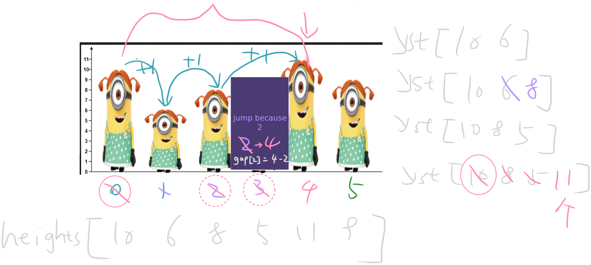

       https://leetcode.com/problems/number-of-visible-people-in-a-queue/
                                        
                    1944. Number of Visible People in a Queue
                 Hard │ 2239  68  │ 73.0% of 177.2K │ 󰛨 Hints


There are n people standing in a queue, and they numbered from 0 to n - 1 in left to right order. You are given an array heights of distinct integers where heights[i] represents the height of the i^th person.

A person can see another person to their right in the queue if everybody in between is shorter than both of them. More formally, the i^th person can see the j^th person if i < j and min(heights[i], heights[j]) > max(heights[i+1], heights[i+2], ..., heights[j-1]).

Return an array answer of length n where answer[i] is the number of people the i^th person can see to their right in the queue.


󰛨 Example 1:

[img](https://assets.leetcode.com/uploads/2021/05/29/queue-plane.jpg)

	│ Input: heights = [10,6,8,5,11,9]
	│ Output: [3,1,2,1,1,0]
	│ Explanation:
	│ Person 0 can see person 1, 2, and 4.
	│ Person 1 can see person 2.
	│ Person 2 can see person 3 and 4.
	│ Person 3 can see person 4.
	│ Person 4 can see person 5.
	│ Person 5 can see no one since nobody is to the right of them.

󰛨 Example 2:

	│ Input: heights = [5,1,2,3,10]
	│ Output: [4,1,1,1,0]


 Constraints:

	* n == heights.length
	
	* 1 <= n <= 10^5
	
	* 1 <= heights[i] <= 10^5
	
	* All the values of heights are unique.

## Solution - monotonic stack 

tip: 
- seems monotonic in the order



```rust

impl Solution {
    pub fn can_see_persons_count(heights: Vec<i32>) -> Vec<i32> {
        let n = heights.len();
        let mut st: Vec<usize> = Vec::with_capacity(n);
        let mut gap: Vec<usize> = vec![0; n];
        let mut ans: Vec<i32> = vec![0; n];

        for i in 0..n {
            while let Some(&last) = st.last() {
                if heights[last] < heights[i] {
                    let mut seen = 0i32;
                    let mut cur = last;

                    while cur < i {
                        cur += gap[cur].max(1);
                        seen += 1;
                    }

                    let dist = i - last;
                    gap[last] = dist;
                    ans[last] = seen;
                    st.pop();
                } else {
                    break;
                }
            }

            st.push(i);
        }

        st.reverse();
        while let Some(left) = st.pop() {
            if let Some(&next) = st.last() {
                let mut seen = 0i32;
                let mut cur = left;

                while cur < next {
                    cur += gap[cur].max(1);
                    seen += 1;
                }

                let dist = next - left;
                gap[left] = dist;
                ans[left] = seen;
            } else {
                ans[left] = 0;
            }
        }

        ans
    }
}
```
