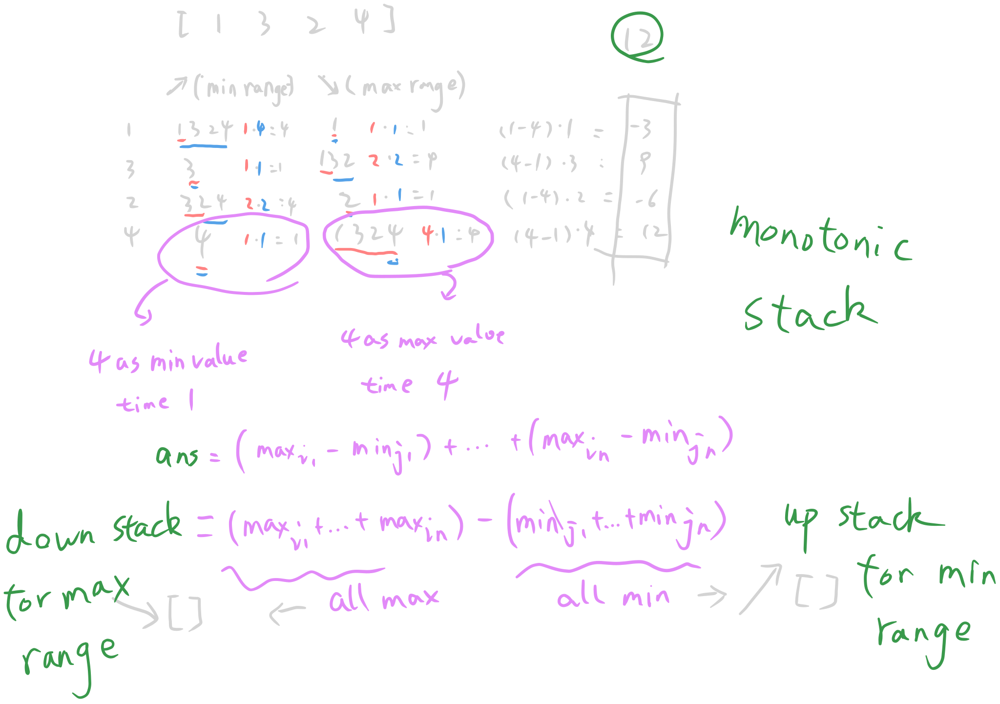

  https://leetcode.com/problems/sum-of-subarray-ranges/
                             
               2104. Sum of Subarray Ranges
    Medium │ 3012  144  │ 61.1% of 371.8K │ 󰛨 Hints


You are given an integer array nums. The range of a subarray of nums is the difference between the largest and smallest element in the subarray.

Return the sum of all subarray ranges of nums.

A subarray is a contiguous non-empty sequence of elements within an array.

󰛨 Example 1:

	│ Input: nums = [1,2,3]
	│ Output: 4
	│ Explanation: The 6 subarrays of nums are the following:
	│ [1], range = largest - smallest = 1 - 1 = 0 
	│ [2], range = 2 - 2 = 0
	│ [3], range = 3 - 3 = 0
	│ [1,2], range = 2 - 1 = 1
	│ [2,3], range = 3 - 2 = 1
	│ [1,2,3], range = 3 - 1 = 2
	│ So the sum of all ranges is 0 + 0 + 0 + 1 + 1 + 2 = 4.

󰛨 Example 2:

	│ Input: nums = [1,3,3]
	│ Output: 4
	│ Explanation: The 6 subarrays of nums are the following:
	│ [1], range = largest - smallest = 1 - 1 = 0
	│ [3], range = 3 - 3 = 0
	│ [3], range = 3 - 3 = 0
	│ [1,3], range = 3 - 1 = 2
	│ [3,3], range = 3 - 3 = 0
	│ [1,3,3], range = 3 - 1 = 2
	│ So the sum of all ranges is 0 + 0 + 0 + 2 + 0 + 2 = 4.

󰛨 Example 3:

	│ Input: nums = [4,-2,-3,4,1]
	│ Output: 59
	│ Explanation: The sum of all subarray ranges of nums is 59.


 Constraints:

	* 1 <= nums.length <= 1000
	
	* -10^9 <= nums[i] <= 10^9


Follow-up: Could you find a solution with O(n) time complexity?

## Solution - Monotonic stack

Tips:
- subarrarys sum can be divided into $all max$ - $all min$
- monotonic offers `nums[i]` as min(by up stack)/max(by down stack) will happens `x` times



```rust
impl Solution {
    pub fn sub_array_ranges(nums: Vec<i32>) -> i64 {
        let n = nums.len();
        let mut up_st: Vec<usize> = Vec::with_capacity(n);
        let mut down_st: Vec<usize> = Vec::with_capacity(n);

        let mut ans = 0i64;

        for i in 0..n {
            while let Some(&up_j) = up_st.last() {
                if nums[up_j] <= nums[i] {
                    break;
                } else {
                    up_st.pop();
                    let l_cnt = if let Some(&up_j_pre) = up_st.last() {
                        up_j - up_j_pre
                    } else {
                        up_j + 1
                    };

                    let r_cnt = i - up_j;

                    let up_contri = nums[up_j] as i64 * l_cnt as i64 * r_cnt as i64;
                    ans -= up_contri;
                }
            }

            while let Some(&down_j) = down_st.last() {
                if nums[down_j] > nums[i] {
                    break;
                } else {
                    down_st.pop();
                    let l_cnt = if let Some(&down_j_pre) = down_st.last() {
                        down_j - down_j_pre
                    } else {
                        down_j + 1
                    };

                    let r_cnt = i - down_j;

                    let down_contri = nums[down_j] as i64 * l_cnt as i64 * r_cnt as i64;
                    ans += down_contri;
                }
            }

            up_st.push(i);
            down_st.push(i);
        }

        while let Some(up_left) = up_st.pop() {
            let l_cnt = if let Some(&up_left_pre) = up_st.last() {
                up_left - up_left_pre
            } else {
                up_left + 1
            };

            let r_cnt = n - up_left;
            let contri = nums[up_left] as i64 * l_cnt as i64 * r_cnt as i64;
            ans -= contri;
        }

        while let Some(down_left) = down_st.pop() {
            let l_cnt = if let Some(&down_left_pre) = down_st.last() {
                down_left - down_left_pre
            } else {
                down_left + 1
            };

            let r_cnt = n - down_left;
            let contri = nums[down_left] as i64 * l_cnt as i64 * r_cnt as i64;
            ans += contri;
        }

        ans
    }
}
```
