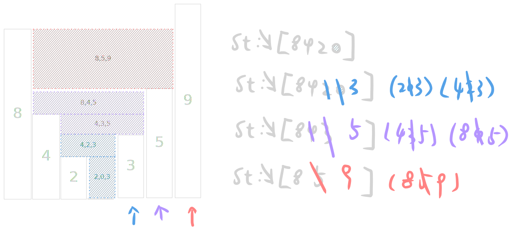

               https://leetcode.com/problems/trapping-rain-water/
                                        
                            42. Trapping Rain Water
                      Hard │ 36491  702  │ 67.3% of 5.3M

Given n non-negative integers representing an elevation map where the width of each bar is 1, compute how much water it can trap after raining.

󰛨 Example 1:

[img](https://assets.leetcode.com/uploads/2018/10/22/rainwatertrap.png)

	│ Input: height = [0,1,0,2,1,0,1,3,2,1,2,1]
	│ Output: 6
	│ Explanation: The above elevation map (black section) is represented by array [0,1,0,2,1,0,1,3,2,1,2,1]. In this case, 6 units of rain water (blue section) are being trapped.

󰛨 Example 2:

	│ Input: height = [4,2,0,3,2,5]
	│ Output: 9


 Constraints:

	* n == height.length
	
	* 1 <= n <= 2 * 10^4
	
	* 0 <= height[i] <= 10^5


## Classic Solution - Mononic stack 
Tips:
1. down don't care, but up care. So it might be mononic here.
2. Water can be divided into ($w1*h1 + w2*h2 + w_n*h_n$), not just($h1 + h2 + h3$)


```rust
impl Solution {
    pub fn trap(height: Vec<i32>) -> i32 {
        let n = height.len();

        let mut stack: Vec<usize> = Vec::with_capacity(n);
        let mut ans = 0i32;

        for i in 0..n {
            // iter (l, mid, r)
            while let Some(&mid) = stack.last() {
                if height[i] <= height[mid] {
                    break;
                }
                stack.pop();

                let Some(&left) = stack.last() else {
                    break;
                };

                let width = (i - left - 1) as i32;
                let h = height[left].min(height[i]) - height[mid];
                if h > 0 {
                    ans += width * h;
                }
            }
            stack.push(i);
        }

        ans
    }
}
```


## Solution - My self
Tips:
1. Only the peak bar should be consider. 
  - Before highest bar, just calculate left peak and right peak and sub-bars between them
  - After highest bar, from right->left, check if there existed one peak bar(L) higher than current (R), if not, focus on it's nearly left side bar(L'). 

```rust
impl Solution {
    pub fn trap(height: Vec<i32>) -> i32 {
        let mut dots: Vec<usize> = Vec::new();
        let mut ans: i32 = 0;

        let mut left = 0;

        for i in 0..height.len() {
            let is_dot = i == 0
                || i == height.len() - 1
                || (height[i - 1] < height[i] && height[i] >= height[i + 1]);

            if !is_dot {
                continue;
            }

            if !dots.is_empty() {
                if height[left] <= height[i] {
                    for j in left + 1..i {
                        let sub = 0.max(height[left] - height[j]);
                        ans += sub;
                    }
                    dots.pop();
                    left = i;
                }
            }

            dots.push(i);
        }

        let mut i = dots.len() - 1;
        while i > 0 && dots[i] != left {
            let r = dots[i];

            let mut j = i - 1;
            while j > 0 && height[dots[j]] < height[r] {
                j -= 1;
            }

            let l = dots[j];
            let v = height[l].min(height[r]);
            for x in l + 1..r {
                let sub = 0.max(v - height[x]);
                ans += sub;
            }

            i = j;
        }

        ans
    }
}
```
