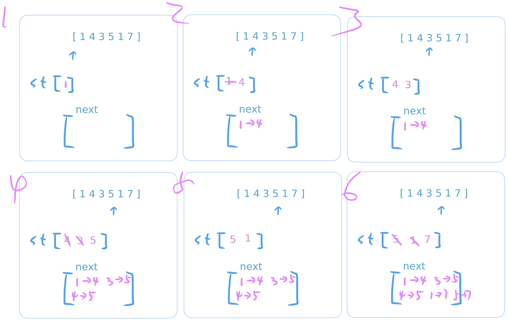

                                  496. Next Greater Element I
                             Easy │ 9935  1116  │ 76.1% of 1.9M


The next greater element of some element x in an array is the first greater element that is to the right of x in the same array.

You are given two distinct 0-indexed integer arrays nums1 and nums2, where nums1 is a subset of nums2.

For each 0 <= i < nums1.length, find the index j such that nums1[i] == nums2[j] and determine the next greater element of nums2[j] in nums2. If there is no next greater element, then the answer for this query is -1.

Return an array ans of length nums1.length such that ans[i] is the next greater element as described above.


󰛨 Example 1:

	│ Input: nums1 = [4,1,2], nums2 = [1,3,4,2]
	│ Output: [-1,3,-1]
	│ Explanation: The next greater element for each value of nums1 is as follows:
	│ - 4 is underlined in nums2 = [1,3,4,2]. There is no next greater element, so the answer is -1.
	│ - 1 is underlined in nums2 = [1,3,4,2]. The next greater element is 3.
	│ - 2 is underlined in nums2 = [1,3,4,2]. There is no next greater element, so the answer is -1.

󰛨 Example 2:

	│ Input: nums1 = [2,4], nums2 = [1,2,3,4]
	│ Output: [3,-1]
	│ Explanation: The next greater element for each value of nums1 is as follows:
	│ - 2 is underlined in nums2 = [1,2,3,4]. The next greater element is 3.
	│ - 4 is underlined in nums2 = [1,2,3,4]. There is no next greater element, so the answer is -1.


 Constraints:

	* 1 <= nums1.length <= nums2.length <= 1000
	
	* 0 <= nums1[i], nums2[i] <= 10^4
	
	* All integers in nums1 and nums2 are unique.
	
	* All the integers of nums1 also appear in nums2.


Follow up: Could you find an O(nums1.length + nums2.length) solution?


## Classic Solution

> Tips:
- nums1 as subset of num2, we can just ignore nums1, just focus nums2
- In nums2, each answer `nums2[j]` is on the left for the question `nums2[i]`, it seems a logic here, consider `l -> r` or `r -> l`



*Mononic stack*


```rust
use std::collections::HashMap;
impl Solution {
    pub fn next_greater_element(nums1: Vec<i32>, nums2: Vec<i32>) -> Vec<i32> {
        let n = nums2.len();
        let mut mono_st: Vec<i32> = Vec::with_capacity(n);

        let mut next_map: HashMap<i32, i32> = HashMap::new();

        for num in nums2 {
            while let Some(&last) = mono_st.last() {
                if (last < num) {
                    mono_st.pop();
                    next_map.insert(last, num);
                } else {
                    break;
                }
            }
            mono_st.push(num);
        }

        nums1
            .iter()
            .map(|v| next_map.get(v).copied().unwrap_or(-1))
            .collect()
    }
}
```


## Solution 2 (Bad)

```rust
use std::collections::HashMap;
impl Solution {
    pub fn next_greater_element(nums1: Vec<i32>, nums2: Vec<i32>) -> Vec<i32> {
        let mut res = vec![-1; nums1.len()];
        let n = nums2.len();
        let mut mono_st: Vec<i32> = Vec::with_capacity(n);

        let idx_map: HashMap<i32, usize> =
            nums1.into_iter().enumerate().map(|a| (a.1, a.0)).collect();

        for i in (0..n).rev() {
            let val = nums2[i];
            let val_map_idx = idx_map.get(&val);

            let mut target = -1;

            while let Some(&last) = mono_st.last() {
                if (last > val) {
                    target = last;
                    break;
                } else {
                    mono_st.pop();
                };
            }

            mono_st.push(val);

            if let Some(&idx) = val_map_idx {
                res[idx] = target;
            };
        }

        res
    }
}
```

