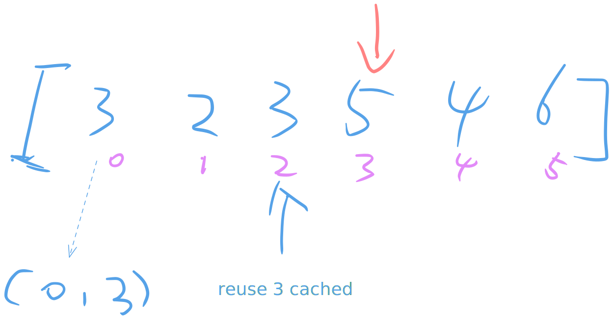
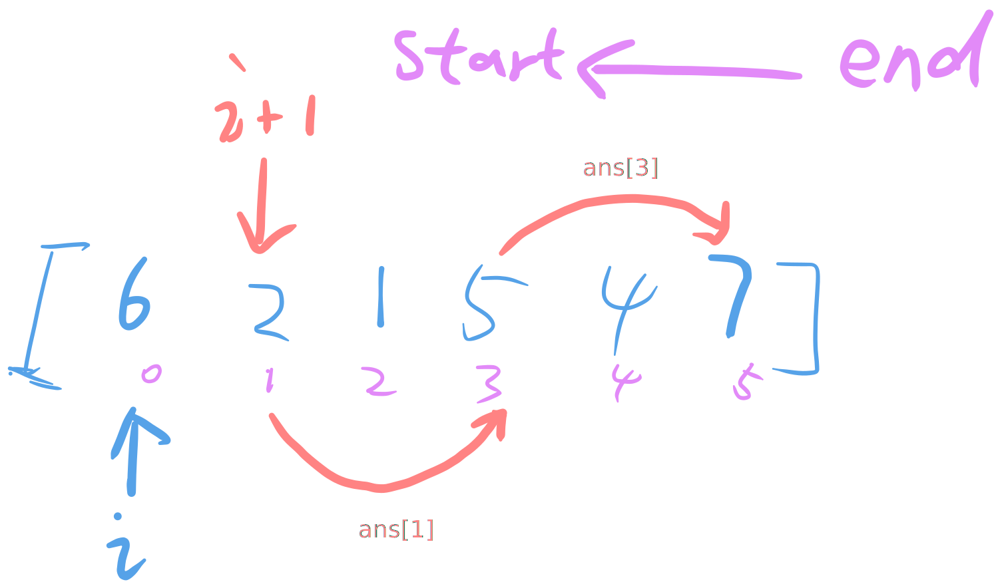
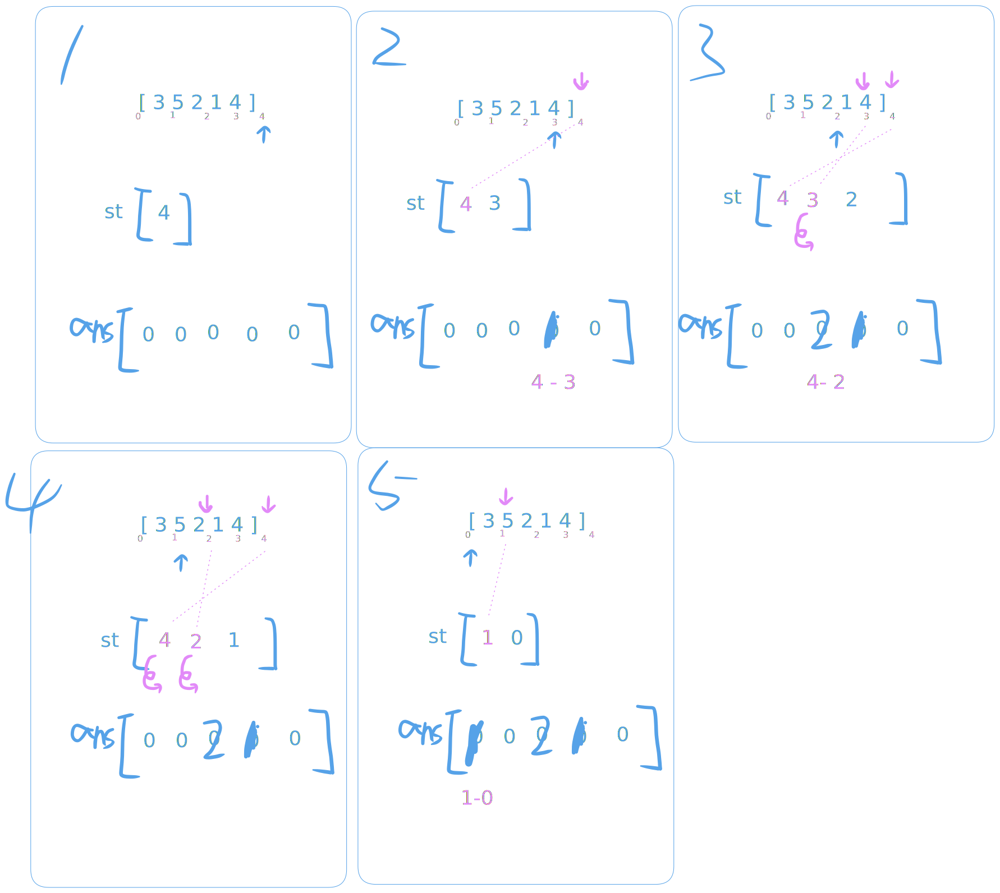

                                   739. Daily Temperatures
                        Medium 󱎖 │ 14736  376  │ 68.7% of 2.5M │ 󰛨 Hints

Given an array of integers temperatures represents the daily temperatures, return
an array answer such that answer[i] is the number of days you have to wait after 
the i^th day to get a warmer temperature. 
If there is no future day for which this is possible, keep answer[i] == 0 instead.

󰛨 Example 1:

	│ Input: temperatures = [73,74,75,71,69,72,76,73]
	│ Output: [1,1,4,2,1,1,0,0]

󰛨 Example 2:

	│ Input: temperatures = [30,40,50,60]
	│ Output: [1,1,1,0]

󰛨 Example 3:

	│ Input: temperatures = [30,60,90]
	│ Output: [1,1,0]

 Constraints:

	* 1 <= temperatures.length <= 10^5
	* 30 <= temperatures[i] <= 100

---

## Solution 1 (Bad)
Tip: 
- If we have got answer of number `i`. Can we reuse it when number `i` again?


*Reused cached left*

```rust
use std::collections::HashMap;
impl Solution {
    pub fn daily_temperatures(temperatures: Vec<i32>) -> Vec<i32> {
        let mut res: Vec<i32> = Vec::new();
        // hashmap records num `v` has been checked with result of (idx_v, pending_v)
        let mut existed_map: HashMap<i32, (usize, usize)> = HashMap::new();

        // pointer
        for (i, &val) in temperatures.iter().enumerate() {
            if (i == temperatures.len() - 1) {
                res.push(0);
                continue;
            }

            // reuse with records
            if let Some(&(e_idex, e_gap)) = existed_map.get(&val) {
                // checked if records can be reused
                if (e_idex + e_gap > i) {
                    let pending = if e_gap > 0 { e_gap - (i - e_idex) } else { 0 };
                    res.push(pending as i32);
                    continue;
                }
            }

            let mut j = i + 1;
            while j < temperatures.len() && temperatures[j] <= val {
                j += 1;
            }

            let pending = if j >= temperatures.len() { 0 } else { j - i };
            res.push(pending as i32);
            existed_map.insert(val, (i, pending));
        }

        res
    }
}
```

---

### Solution 2 

Tip:
- The answer `j` of `i` is always subjects `j > i`. So how about iterating Vec from end to start, answer may be reused


*Reused cached for quick jump*


```rust
impl Solution {
    pub fn daily_temperatures(temperatures: Vec<i32>) -> Vec<i32> {
        let n = temperatures.len();
        let mut ans = vec![0; n];

        for i in (0..n.saturating_sub(1)).rev() {
            let mut j = i + 1;
            while j < n && temperatures[j] <= temperatures[i] {
                if ans[j] == 0 {
                    j = n;
                    break;
                }
                j += ans[j] as usize; // reused the info that 
            }
            if j < n {
                ans[i] = (j - i) as i32;
            }
        }
        ans
    }
}
```

## Class Solution

Tip:
- The answer `j` of `i` is always subjects `j > i`. So how about iterating Vec from end to start, answer may be reused


*Mononic stack for quick jump*

> st keep a mononic index for quick jump, like on [vec[1]=5], we jump from vec[2] to vec[4], no need vec[3] 


 
```rust

impl Solution {
    pub fn daily_temperatures(temperatures: Vec<i32>) -> Vec<i32> {
        let n = temperatures.len();
        let mut ans = vec![0; n];
        let mut st: Vec<usize> = Vec::with_capacity(n);

        for i in (0..n).rev() {
            while let Some(&j) = st.last() {
                if temperatures[j] <= temperatures[i] {
                    st.pop();
                } else {
                    break;
                }
            }
            if let Some(&j) = st.last() {
                ans[i] = (j - i) as i32;
            }
            st.push(i);
        }
        ans
    }
}
```
