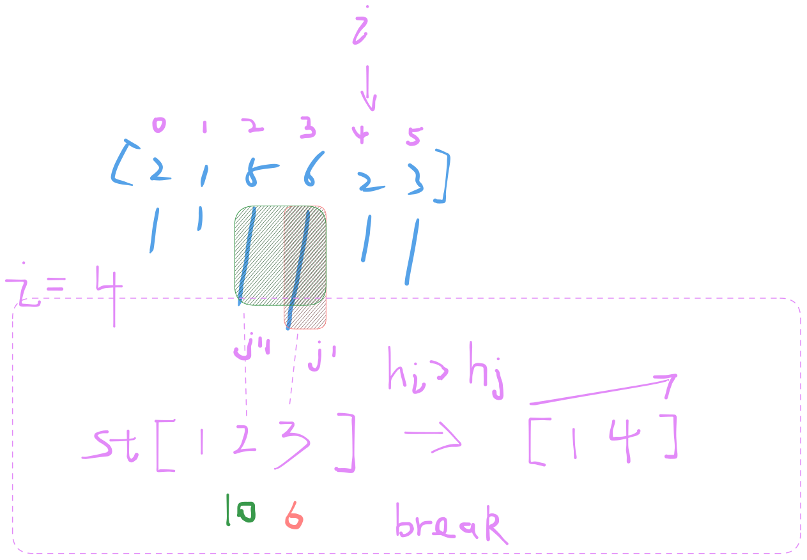

          84. Largest Rectangle in Histogram
   Hard │ 19701  391  │ 49.9% of 3.1M

Given an array of integers heights representing the histogram's bar height where the width of each bar is 1, return the area of the largest rectangle in the histogram.

󰛨 Example 1:

	│ Input: heights = [2,1,5,6,2,3]
	│ Output: 10
	│ Explanation: The above is a histogram where width of each bar is 1.
	│ The largest rectangle is shown in the red area, which has an area = 10 units.

󰛨 Example 2:

	│ Input: heights = [2,4]
	│ Output: 4


 Constraints:

	* 1 <= heights.length <= 10^5
	
	* 0 <= heights[i] <= 10^4


## Classic solution - Monotonic stack

Tips:
- the answer must in all rectangle of h[i] * biggest width of h[i] （h[i] means height of index `i` as the lowest height of reacangle）. So we can iterate all h[i], then get the maximum result
- How to iterate? Low->High h[i] stack(h[i]) , the left one h[j](left side lower) to the h[r](right side lower) as the width



```rust
impl Solution {
    pub fn largest_rectangle_area(heights: Vec<i32>) -> i32 {
        let mut st: Vec<usize> = Vec::new();
        let mut max_area = 0;

        for (i, &h) in heights.iter().enumerate() {
            if i == 0 {
                st.push(i);
                continue;
            }

            while let Some(&last_idx) = st.last() {
                let v = *heights.get(last_idx).unwrap();
                if v > h {
                    st.pop();
                    let w = if let Some(&left) = st.last() {
                        i - left - 1
                    } else {
                        i
                    };
                    max_area = max_area.max(v * w as i32);
                } else {
                    break;
                }
            }

            st.push(i);
        }

        while let Some(last_idx) = st.pop() {
            let v = heights[last_idx];

            let w = if let Some(&left) = st.last() {
                heights.len() - left - 1
            } else {
                heights.len()
            };

            max_area = max_area.max(v * w as i32);
        }

        max_area
    }
}
```
