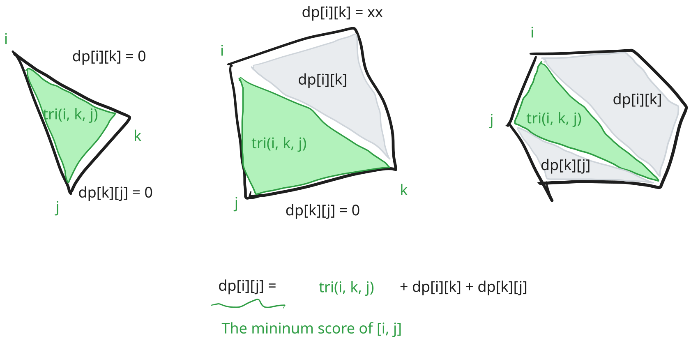
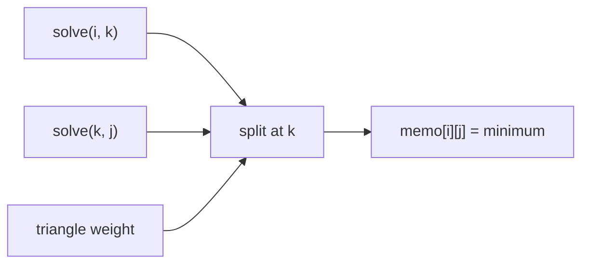

https://leetcode.com/problems/minimum-score-triangulation-of-polygon/

# 1039. Minimum Score Triangulation of Polygon

Medium

You have a convex `n`-sided polygon where each vertex has an integer value. You are given an integer array `values` where `values[i]` is the value of the `ith` vertex in clockwise order.

Polygon triangulation divides the polygon into exactly `n - 2` triangles whose vertices are original polygon vertices. The weight of a triangle is the product of the values at its vertices. Return the minimum possible sum of triangle weights over all triangulations.

## Example 1


Input: `values = [1,2,3]`

Output: `6`

Explanation: The polygon is already triangulated, and the score of the only triangle is 6.

## Example 2


Input: `values = [3,7,4,5]`

Output: `144`

Explanation: There are two triangulations, with possible scores: `3*7*5 + 4*5*7 = 245`, or `3*4*5 + 3*4*7 = 144`. The minimum score is 144.

## Example 3


Input: `values = [1,3,1,4,1,5]`

Output: `13`

Explanation: The minimum score triangulation is `1*1*3 + 1*1*4 + 1*1*5 + 1*1*1 = 13`.

## Constraints

- `n == values.length`
- `3 <= n <= 50`
- `1 <= values[i] <= 100`

## My Solution - Two-Dimensional Interval DP

### Approach

Let `dp[i][j]` be the minimum score needed to triangulate the polygonal chain from vertex `i` to vertex `j`, inclusive. A chain with fewer than three vertices contains no triangle, so:

```text
dp[i][i] = 0
dp[i][i + 1] = 0
```

For an interval `[i, j]` with at least three vertices, choose the third vertex `k` of the triangle containing edge `(i, j)`. That triangle contributes `values[i] * values[k] * values[j]`, while the two remaining chains are solved independently:

```text
dp[i][j] =
    min(
        dp[i][k] + dp[k][j] + values[i] * values[k] * values[j]
    ) for i < k < j
```

Every triangulation of `[i, j]` has exactly one triangle using the boundary edge `(i, j)`, so trying every possible `k` considers every possible first split. Once that triangle is fixed, no triangle crosses either subchain, which makes the two subproblems independent. Taking the minimum therefore gives the optimal score by optimal substructure.

The implementation fills intervals in increasing order of their length. When processing `[i, j]`, both `[i, k]` and `[k, j]` are shorter intervals and have already been computed. The explicit `n == 3` branch is a harmless shortcut for the only possible triangle; the general table also handles that case.

For the official example `values = [3,7,4,5]`, the full interval `[0,3]` tries `k = 1` and `k = 2`:



```text
k = 1: dp[0][1] + dp[1][3] + 3*7*5 = 245
k = 2: dp[0][2] + dp[2][3] + 3*4*5 = 144
```

The second split is selected.

### Complexity

- Time: `O(n³)`
- Space: `O(n²)`

```rust
impl Solution {
    pub fn min_score_triangulation(values: Vec<i32>) -> i32 {
        let n = values.len();

        if n == 3 {
            return values.iter().fold(1, |res, i| res * i);
        }

        let mut dp = vec![vec![i32::MAX; n]; n];
        // init
        for i in 0..n {
            dp[i][i] = 0;
            if i + 1 < n {
                dp[i][i + 1] = 0;
            }
        }

        for len in 3..=n {
            for i in 0..=n - len {
                let j = i + len - 1;

                for k in i + 1..j {
                    dp[i][j] =
                        dp[i][j].min(dp[i][k] + dp[k][j] + values[i] * values[k] * values[j]);
                }
            }
        }

        dp[0][n - 1]
    }
}
```

## Classic Solution - 1 - Top-Down Memoized Interval DP

### Approach

Use the same interval definition, but compute a state only when the recursion needs it. Let `memo[i][j]` store the minimum score for the chain from vertex `i` to vertex `j`. Intervals with fewer than three vertices have score zero. For a larger interval, try every possible third vertex `k` of the triangle containing edge `(i, j)`:

```text
memo[i][j] =
    min(
        solve(i, k) + solve(k, j)
        + values[i] * values[k] * values[j]
    ) for i < k < j
```

The recursive calls terminate because both subintervals are shorter than `[i, j]`. Once a state has been computed, the memo table returns it immediately on later calls, so each interval is solved once and every possible split is examined exactly as in the bottom-up recurrence.



For `values = [3,7,4,5]`, `solve(0, 3)` evaluates the two choices `k = 1` and `k = 2`; memoization ensures that the smaller intervals needed by both choices are not recomputed.

### Complexity

- Time: `O(n³)`
- Space: `O(n²)`

```rust
impl Solution {
    pub fn min_score_triangulation(values: Vec<i32>) -> i32 {
        let n = values.len();
        let mut memo = vec![vec![None; n]; n];

        fn solve(
            i: usize,
            j: usize,
            values: &[i32],
            memo: &mut [Vec<Option<i32>>],
        ) -> i32 {
            if j - i < 2 {
                return 0;
            }
            if let Some(cached) = memo[i][j] {
                return cached;
            }

            let mut best = i32::MAX;
            for k in i + 1..j {
                let score = solve(i, k, values, memo)
                    + solve(k, j, values, memo)
                    + values[i] * values[k] * values[j];
                best = best.min(score);
            }

            memo[i][j] = Some(best);
            best
        }

        solve(0, n - 1, &values, &mut memo)
    }
}
```
