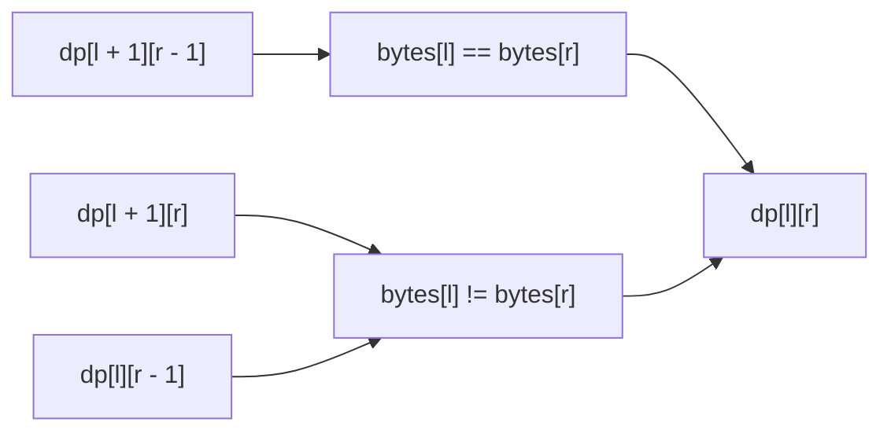

https://leetcode.com/problems/minimum-insertion-steps-to-make-a-string-palindrome/

# 1312. Minimum Insertion Steps to Make a String Palindrome

Hard

Given a string `s`, one step can insert any character at any index. Return the minimum number of insertions needed to make `s` a palindrome.

## Example 1

Input: `s = "zzazz"`

Output: `0`

Explanation: The string is already a palindrome.

## Example 2

Input: `s = "mbadm"`

Output: `2`

Explanation: The string can become `"mbdadbm"` or `"mdbabdm"`.

## Example 3

Input: `s = "leetcode"`

Output: `5`

Explanation: Inserting 5 characters can produce `"leetcodocteel"`.

## Constraints

- `1 <= s.length <= 500`
- `s` consists of lowercase English letters.

## My Solution - Minimum-Cost Interval DP

### Approach

Define:

```text
dp[l][r] = the minimum insertions needed to make s[l..=r] a palindrome
```

The transition is determined by the two boundary characters.

If they already match, they can remain as the two ends of the final palindrome, so only the inner interval needs to be solved:

```text
dp[l][r] = dp[l + 1][r - 1]    when bytes[l] == bytes[r]
```

If they do not match, one insertion must provide a matching partner for one of the boundaries. Matching the left boundary leaves `[l + 1, r]`; matching the right boundary leaves `[l, r - 1]`. Choose the cheaper option and count the new insertion:

```text
dp[l][r] = min(dp[l + 1][r], dp[l][r - 1]) + 1
```

Every interval of length one needs zero insertions, which is already represented by the zero-initialized diagonal. The dependencies are shorter intervals, so the table is filled by increasing interval length:



### Correctness

For matching boundary characters, any valid palindrome completion can keep those characters paired, so the remaining work is exactly the inner interval. For different boundary characters, the outer pair cannot match without an insertion; the first required insertion can match either boundary, leaving one of the two smaller intervals. Taking the minimum covers both choices. By induction on interval length, every `dp[l][r]` is optimal, so `dp[0][n - 1]` is the minimum number of insertions for the whole string.

### Complexity

- Time: `O(n²)`
- Space: `O(n²)`

```rust
impl Solution {
    pub fn min_insertions(s: String) -> i32 {
        let n = s.len();
        let bytes = s.as_bytes();

        // dp[l][r]: the mininum steps insert for turn s[l..=r] to a palindrome string
        let mut dp = vec![vec![0; n]; n];

        for len in 2..=n {
            for l in 0..=n - len {
                let r = l + len - 1;

                if bytes[l] == bytes[r] {
                    dp[l][r] = dp[l + 1][r - 1];
                } else {
                    dp[l][r] = dp[l + 1][r].min(dp[l][r - 1]) + 1;
                }
            }
        }

        dp[0][n - 1]
    }
}
```

## Classic Solution - 1 - String Length Minus Longest Palindromic Subsequence

### Approach

Keep the longest palindromic subsequence already present in the original string. Those characters can remain in the final palindrome; every other original character needs one inserted matching character. Therefore:

```text
minimum insertions = n - longest palindromic subsequence length
```

Compute the longest palindromic subsequence with interval DP:

```text
lps[l][r] = the longest palindromic subsequence length in s[l..=r]
```

If the boundaries match, include both of them:

```text
lps[l][r] = lps[l + 1][r - 1] + 2
```

Otherwise, discard one boundary from the subsequence:

```text
lps[l][r] = max(lps[l + 1][r], lps[l][r - 1])
```

### Correctness

The characters retained from the input must form a palindromic subsequence of the final palindrome. Retaining a longer such subsequence leaves fewer characters that need inserted partners. Conversely, after retaining any longest palindromic subsequence, each omitted character can be matched by inserting one character, producing a palindrome. Thus the optimum is exactly `n - LPS`.

### Complexity

- Time: `O(n²)`
- Space: `O(n²)`

```rust
impl Solution {
    pub fn min_insertions(s: String) -> i32 {
        let bytes = s.as_bytes();
        let n = bytes.len();
        let mut lps = vec![vec![0; n]; n];

        for i in 0..n {
            lps[i][i] = 1;
        }

        for len in 2..=n {
            for left in 0..=n - len {
                let right = left + len - 1;

                lps[left][right] = if bytes[left] == bytes[right] {
                    if len == 2 {
                        2
                    } else {
                        lps[left + 1][right - 1] + 2
                    }
                } else {
                    lps[left + 1][right].max(lps[left][right - 1])
                };
            }
        }

        (n as i32) - lps[0][n - 1]
    }
}
```
