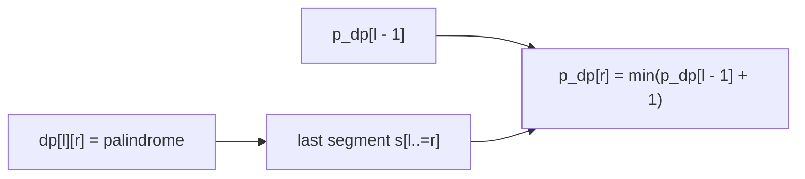

https://leetcode.com/problems/palindrome-partitioning-ii/

# 132. Palindrome Partitioning II

Hard

Given a string `s`, partition it so that every substring in the partition is a palindrome. Return the minimum number of cuts needed.

## Example 1

Input: `s = "aab"`

Output: `1`

Explanation: The partition `["aa", "b"]` requires one cut.

## Example 2

Input: `s = "a"`

Output: `0`

## Example 3

Input: `s = "ab"`

Output: `1`

## Constraints

- `1 <= s.length <= 2000`
- `s` consists of lowercase English letters only.

## My Solution - Palindrome Table Plus Prefix Minimum-Cut DP

### Approach

The solution uses two related states.

First, build the interval property table:

```text
dp[l][r] = whether s[l..=r] is a palindrome
```

The boundary recurrence is:

```text
dp[l][r] = bytes[l] == bytes[r]
           && (length <= 2 || dp[l + 1][r - 1])
```

Then define:

```text
p_dp[r] = the minimum cuts needed for the prefix s[0..=r]
```

Assume the final palindrome segment of this prefix is `s[l..=r]`. If `l == 0`, the entire prefix is a palindrome and needs zero cuts. Otherwise, the earlier prefix ends at `l - 1`, so the candidate is:

```text
p_dp[l - 1] + 1
```

The `+1` is the cut between the earlier prefix and the final palindrome segment. For every palindromic `s[l..=r]`, minimize `p_dp[r]` with this candidate.

The palindrome table is filled by increasing interval length. The prefix table is filled by increasing `r`, because every transition reads only a previously solved prefix ending before `r`.



The submitted variable comment calls `p_dp` a minimum parts count, but the stored value is actually a minimum cut count: `p_dp[0] = 0`, and a non-empty final segment contributes one boundary cut only when `l > 0`.

### Correctness

The interval recurrence correctly identifies every palindromic substring by matching its boundaries and consulting its inner interval. For a fixed prefix ending at `r`, every valid partition has a unique final palindrome segment `s[l..=r]`. If `l == 0`, it contributes zero cuts; otherwise, combining it with an optimal partition of `s[0..=l-1]` contributes exactly one additional cut. Enumerating every possible `l` therefore considers every valid final segment and selects the minimum possible cut count.

### Complexity

- Time: `O(n²)`
- Space: `O(n²)`

```rust
impl Solution {
    pub fn min_cut(s: String) -> i32 {
        let n = s.len();
        let bytes = s.as_bytes();

        let mut dp = vec![vec![false; n]; n];

        for i in 0..n {
            dp[i][i] = true;
        }

        for len in 2..=n {
            for l in 0..=n - len {
                let r = l + len - 1;

                dp[l][r] = bytes[l] == bytes[r] && (len <= 2 || dp[l + 1][r - 1]);
            }
        }

        // p_dp[i] means (0..=i) mininum parts divide needed
        let mut p_dp = vec![n - 1; n];
        p_dp[0] = 0;

        for r in 1..n {
            for l in 0..=r {
                if dp[l][r] {
                    let parts = if l == 0 { 0 } else { p_dp[l - 1] + 1 };
                    p_dp[r] = p_dp[r].min(parts);
                }
            }
        }

        p_dp[n - 1] as i32
    }
}
```

## Classic Solution - 1 - Center Expansion Plus Prefix Cuts

### Approach

The prefix DP only needs to know which palindrome segments end at each position. Instead of storing every interval in a table, expand around every possible palindrome center:

- `(center, center)` for odd-length palindromes;
- `(center, center + 1)` for even-length palindromes.

Whenever expansion finds a palindrome `s[left..=right]`, update the prefix cut state:

```text
cuts[right + 1] = min(cuts[right + 1], cuts[left] + 1)
```

Here `cuts[k]` means the minimum cuts for the half-open prefix `s[0..k)`. The sentinel value `cuts[0] = -1` makes a palindrome beginning at index zero contribute zero cuts:

```text
cuts[right + 1] = cuts[0] + 1 = 0
```

The center index is processed from left to right. Any prefix ending before the current palindrome's left boundary has already been finalized, so `cuts[left]` is safe to use during the expansion.

### Correctness

Every palindromic substring has either a character center or a gap center, and the two expansion passes enumerate both types. Each discovered palindrome is a possible final segment of the prefix ending at `right`, and the update combines it with the optimal cuts before `left`. Since all possible final segments are considered, the resulting `cuts[n]` is optimal.

### Complexity

- Time: `O(n²)`
- Space: `O(n)`

```rust
impl Solution {
    pub fn min_cut(s: String) -> i32 {
        let bytes = s.as_bytes();
        let n = bytes.len();
        let mut cuts: Vec<i32> = (0..=n).map(|i| i as i32 - 1).collect();

        fn expand(bytes: &[u8], left: isize, right: isize, cuts: &mut [i32]) {
            let mut left = left;
            let mut right = right;

            while left >= 0
                && right < bytes.len() as isize
                && bytes[left as usize] == bytes[right as usize]
            {
                let l = left as usize;
                let r = right as usize;
                cuts[r + 1] = cuts[r + 1].min(cuts[l] + 1);
                left -= 1;
                right += 1;
            }
        }

        for center in 0..n {
            expand(bytes, center as isize, center as isize, &mut cuts);
            expand(
                bytes,
                center as isize,
                center as isize + 1,
                &mut cuts,
            );
        }

        cuts[n]
    }
}
```
