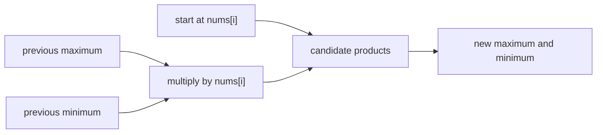

https://leetcode.com/problems/maximum-product-subarray/

# 152. Maximum Product Subarray

Medium

Given an integer array `nums`, find a subarray that has the largest product, and return the product. The product of every subarray in the test cases fits in a 32-bit integer.

## Example 1

Input: `nums = [2,3,-2,4]`

Output: `6`

Explanation: `[2,3]` has the largest product 6.

## Example 2

Input: `nums = [-2,0,-1]`

Output: `0`

Explanation: The result cannot be 2, because `[-2,-1]` is not a subarray.

## Constraints

- `1 <= nums.length <= 2 * 10^4`
- `-10 <= nums[i] <= 10`
- The product of any subarray of `nums` is guaranteed to fit in a 32-bit integer.

## My Solution - Maximum and Minimum Product DP

### Approach

Define two states for every index `i`:

```text
dp[i]   = maximum product of a non-empty subarray ending at nums[i]
n_dp[i] = minimum product of a non-empty subarray ending at nums[i]
```

The minimum state is essential. When `nums[i]` is negative, multiplying the smallest negative product can produce the largest positive product. For example:

```text
(-2) * (-3) = 6
```

For a subarray ending at `nums[i]`, either start a new subarray at `nums[i]`, or extend a subarray ending at `nums[i - 1]`. Both the previous maximum and previous minimum must be considered:

```text
dp[i] = max(
    nums[i],
    nums[i] * dp[i - 1],
    nums[i] * n_dp[i - 1]
)

n_dp[i] = min(
    nums[i],
    nums[i] * dp[i - 1],
    nums[i] * n_dp[i - 1]
)
```

The submitted code stores these two states in separate arrays. `res` tracks the largest `dp[i]` over every endpoint because the optimal subarray may finish anywhere.

The transition also handles zero without a special branch. If `nums[i] == 0`, both candidate products become zero and both states reset to zero, so a later non-zero value can start a new subarray.

For the official example `[2,3,-2,4]`, the ending states are:

```text
value:  2    3    -2    4
max:    2    6    -2    4
min:    2    3   -12    -48
```

The global maximum is `6`. At `-2`, the previous maximum `6` produces `-12`, while the previous minimum `3` produces `-6`; retaining both states preserves all possible optimal continuations.



### Correctness Invariant

After processing index `i`, `dp[i]` and `n_dp[i]` are respectively the maximum and minimum products among all non-empty subarrays ending at `i`. Every such subarray either consists only of `nums[i]` or extends a subarray ending at `i - 1`. The transition enumerates exactly these possibilities and takes their maximum and minimum, so the invariant is preserved. The maximum over all `dp[i]` values is therefore the answer.

### Complexity

- Time: `O(n)`
- Space: `O(n)`

```rust
impl Solution {
    pub fn max_product(nums: Vec<i32>) -> i32 {
        let n = nums.len();
        let mut dp = nums.clone();
        let mut n_dp = nums.clone();

        let mut res = dp[0];

        for i in 1..n {
            let v = nums[i] * dp[i - 1];
            let n_v = nums[i] * n_dp[i - 1];

            dp[i] = nums[i].max(v).max(n_v);
            n_dp[i] = nums[i].min(v).min(n_v);

            res = res.max(dp[i]);
        }

        res
    }
}
```

## Classic Solution - 1 - Space-Optimized Maximum/Minimum DP

### Approach

The recurrence only needs the maximum and minimum products from the previous index. Replace the two arrays with four scalar values:

- `current_max`: largest product ending at the current position;
- `current_min`: smallest product ending at the current position;
- `answer`: largest product seen so far;
- temporary candidates for the next state.

The temporary values are important: `current_max` and `current_min` must both be computed from the same previous pair. Updating one before calculating the other would lose a dependency.

For each `num`, evaluate the three possibilities:

```text
num
num * current_max
num * current_min
```

Then assign their maximum to `current_max` and their minimum to `current_min`. A negative number swaps the roles of large and small products automatically; a zero makes both states zero and starts a new segment afterward.

### Complexity

- Time: `O(n)`
- Space: `O(1)`

```rust
impl Solution {
    pub fn max_product(nums: Vec<i32>) -> i32 {
        let mut current_max = nums[0];
        let mut current_min = nums[0];
        let mut answer = nums[0];

        for &num in nums.iter().skip(1) {
            let candidates = [
                num,
                num * current_max,
                num * current_min,
            ];

            current_max = candidates[0].max(candidates[1]).max(candidates[2]);
            current_min = candidates[0].min(candidates[1]).min(candidates[2]);
            answer = answer.max(current_max);
        }

        answer
    }
}
```
