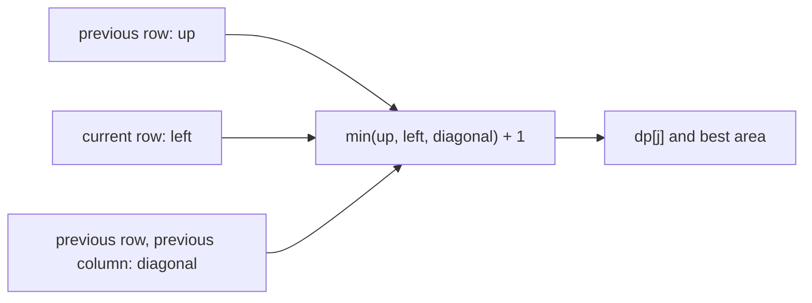

https://leetcode.com/problems/maximal-square/

# 221. Maximal Square

Medium

Given an `m x n` binary `matrix` filled with `0`'s and `1`'s, find the largest square containing only `1`'s and return its area.

## Example 1

Input: `matrix = [["1","0","1","0","0"],["1","0","1","1","1"],["1","1","1","1","1"],["1","0","0","1","0"]]`

Output: `4`

## Example 2

Input: `matrix = [["0","1"],["1","0"]]`

Output: `1`

## Example 3

Input: `matrix = [["0"]]`

Output: `0`

## Constraints

- `m == matrix.length`
- `n == matrix[i].length`
- `1 <= m, n <= 300`
- `matrix[i][j]` is `'0'` or `'1'`.

## My Solution - 2D Dynamic Programming

### Approach

`dp[i][j]` stores the side length of the largest all-`1` square whose bottom-right corner is `(i, j)`.

For a `1` in an interior cell, the square can expand only as far as the smallest square ending above, to the left, and at the upper-left diagonal. The explicit character checks skip cells that cannot form a 2×2 square; the `2.max(...)` is therefore redundant but safe. Each cell contributes its area candidate `dp[i][j] * dp[i][j]` to the answer.

The invariant is that, after processing `(i, j)`, `dp[i][j]` is the maximum valid square side ending at that cell. The three-neighbor minimum prevents a zero in the upper-left portion from being hidden by larger values above and to the left.

### Complexity

- Time: `O(mn)`
- Space: `O(mn)`

```rust
impl Solution {
    pub fn maximal_square(matrix: Vec<Vec<char>>) -> i32 {
        let n = matrix.len();
        if n == 0 {
            return 0;
        }

        let m = matrix[0].len();

        let mut dp = vec![vec![0; m]; n];

        let mut res = 0;

        for i in 0..n {
            for j in 0..m {
                if matrix[i][j] == '0' {
                    continue;
                }

                if matrix[i][j] == '1' {
                    dp[i][j] = 1;
                    res = res.max(1);

                    if i == 0 || j == 0 {
                        continue;
                    }

                    if matrix[i - 1][j] == '0'
                        || matrix[i][j - 1] == '0'
                        || matrix[i - 1][j - 1] == '0'
                    {
                        continue;
                    }

                    dp[i][j] = 2.max(dp[i - 1][j - 1].min(dp[i - 1][j].min(dp[i][j - 1])) + 1);

                    res = res.max(dp[i][j] * dp[i][j]);
                }
            }
        }

        res
    }
}
```

## Classic Solution - 1 - 1D Dynamic Programming

### Approach

Use one DP row where `dp[j]` represents the square side length ending at the current row and column `j`. Before overwriting `dp[j]`, save its old value as `up`, and keep `diagonal` equal to the previous row's upper-left value.

For each `1`, the same recurrence applies:

`current = min(up, left, diagonal) + 1`

For each `0`, set `dp[j]` to zero. The invariant is that entries to the left already describe the current row, entries to the right still describe the previous row, and `diagonal` preserves the previous upper-left state.

This reduces auxiliary memory from a full matrix to one row without changing the recurrence or correctness argument.

### Complexity

- Time: `O(mn)`
- Space: `O(n)`



```rust
impl Solution {
    pub fn maximal_square(matrix: Vec<Vec<char>>) -> i32 {
        if matrix.is_empty() || matrix[0].is_empty() {
            return 0;
        }

        let columns = matrix[0].len();
        let mut dp = vec![0; columns + 1];
        let mut best_side = 0;

        for row in matrix {
            let mut diagonal = 0;

            for (j, cell) in row.into_iter().enumerate() {
                let column = j + 1;
                let up = dp[column];

                if cell == '1' {
                    dp[column] = 1 + dp[column].min(dp[column - 1]).min(diagonal);
                    best_side = best_side.max(dp[column]);
                } else {
                    dp[column] = 0;
                }

                diagonal = up;
            }
        }

        best_side * best_side
    }
}
```
