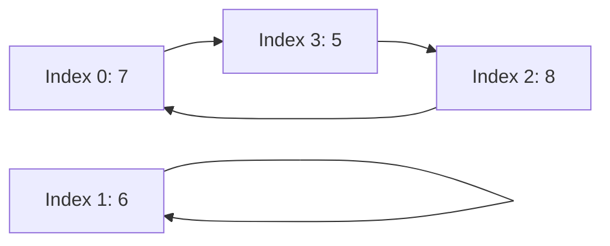

https://leetcode.com/problems/minimum-number-of-operations-to-sort-a-binary-tree-by-level/

# 2471. Minimum Number of Operations to Sort a Binary Tree by Level

Medium

You are given the `root` of a binary tree with **unique values**. In one operation, you can choose any two nodes **at the same level** and swap their values.

Return the minimum number of operations needed to make the values at each level sorted in a **strictly increasing order**.

The **level** of a node is the number of edges along the path between it and the root node.

## Example 1


```text
Input: root = [1,4,3,7,6,8,5,null,null,null,null,9,null,10]
Output: 3
Explanation:
- Swap 4 and 3. The 2nd level becomes [3,4].
- Swap 7 and 5. The 3rd level becomes [5,6,8,7].
- Swap 8 and 7. The 3rd level becomes [5,6,7,8].
We used 3 operations so return 3.
It can be proven that 3 is the minimum number of operations needed.
```

## Example 2


```text
Input: root = [1,3,2,7,6,5,4]
Output: 3
Explanation:
- Swap 3 and 2. The 2nd level becomes [2,3].
- Swap 7 and 4. The 3rd level becomes [4,6,5,7].
- Swap 6 and 5. The 3rd level becomes [4,5,6,7].
We used 3 operations so return 3.
It can be proven that 3 is the minimum number of operations needed.
```

## Example 3


```text
Input: root = [1,2,3,4,5,6]
Output: 0
Explanation: Each level is already sorted in increasing order so return 0.
```

## Constraints

- The number of nodes in the tree is in the range `[1, 10^5]`.
- `1 <= Node.val <= 10^5`
- All the values of the tree are **unique**.

## My Solution - BFS + Target-Index Hash Map

### Approach

Use BFS to collect the node values one level at a time. Copy and sort the current level to obtain the target array `right_level`, then use a hash map to record the target index of each value.

Scan the level from left to right. If `level[i]` is not the target value, swap it with the value at its final target index, `expect[level[i]]`. Every swap places the current `level[i]` into its correct position, so index `i` eventually becomes fixed. This process is equivalent to resolving the cycles in the permutation from current indices to target indices. A cycle of length `k` requires exactly `k - 1` swaps, so the resulting count is minimal.

This relies on the constraint that all node values are globally unique. Although `expect` is reused across levels without being cleared, different levels cannot contain the same key, so a stale index can never conflict with a current value.

The `seen` map is unused and can be removed. Under the current constraints, `expect.get(...).unwrap()` always finds a value, but it remains a panic-capable operation. The code would become less robust if it were reused without the uniqueness constraint or if the map construction changed. The classic solution below needs no hash map and does not use `unwrap`.

### Complexity

- Time: `O(n log n)`. The total sorting cost across all levels is at most `O(n log n)`, while traversal and swaps take `O(n)` in total.
- Space: `O(n)`. The queue, current-level arrays, sorted copy, and hash map hold at most a linear amount of data.

```rust
// Definition for a binary tree node.
// #[derive(Debug, PartialEq, Eq)]
// pub struct TreeNode {
//     pub val: i32,
//     pub left: Option<Rc<RefCell<TreeNode>>>,
//     pub right: Option<Rc<RefCell<TreeNode>>>,
// }
//
// impl TreeNode {
//     #[inline]
//     pub fn new(val: i32) -> Self {
//         TreeNode {
//             val,
//             left: None,
//             right: None,
//         }
//     }
// }

use std::cell::RefCell;
use std::collections::{HashMap, VecDeque};
use std::rc::Rc;

impl Solution {
    pub fn minimum_operations(root: Option<Rc<RefCell<TreeNode>>>) -> i32 {
        let mut res = 0;
        let mut cur_q = VecDeque::new();

        if let Some(node) = &root {
            cur_q.push_back(node.clone());
        }

        let mut expect: HashMap<i32, usize> = HashMap::new();
        let mut seen: HashMap<i32, bool> = HashMap::new();

        while !cur_q.is_empty() {
            let mut level = Vec::new();

            for _ in 0..cur_q.len() {
                if let Some(node) = cur_q.pop_front() {
                    let n = node.borrow();

                    level.push(n.val);

                    if let Some(l) = &n.left {
                        cur_q.push_back(l.clone());
                    }

                    if let Some(r) = &n.right {
                        cur_q.push_back(r.clone());
                    }
                }
            }

            // calculate level
            let mut right_level = level.clone();
            right_level.sort();

            for (i, &v) in right_level.iter().enumerate() {
                expect.insert(v, i);
            }

            for i in 0..level.len() {
                while level[i] != right_level[i] {
                    let target_i = *expect.get(&level[i]).unwrap();
                    level.swap(i, target_i);
                    res += 1;
                }
            }
        }

        res
    }
}
```

## Classic Solution - 1 - BFS + Permutation Cycles

### Approach

BFS separates the problem into independent levels. For a level of length `m`, create an index array `order = [0, 1, ..., m - 1]` and sort it by the corresponding node values. After sorting, `order[target]` is the original index of the value that belongs at target index `target`, so `order` represents a permutation.

For the third level in Example 1:

```text
Current values: [7, 6, 8, 5]
Sorted values:  [5, 6, 7, 8]
Target index:     0  1  2  3
```

Sorting the original indices by their values produces `order = [3, 1, 0, 2]`:

| Target index | Required value | Original index |
| ---: | ---: | ---: |
| 0 | 5 | 3 |
| 1 | 6 | 1 |
| 2 | 7 | 0 |
| 3 | 8 | 2 |

Following `order` from any index eventually returns to the starting index because every original index appears exactly once. This decomposes the permutation into disjoint cycles:

```text
0 -> 3 -> 2 -> 0
1 -> 1
```

The first cycle says that the values at indices `0`, `3`, and `2` are cyclically misplaced. The second cycle is a self-cycle, meaning the value at index `1` is already correct.

For a cycle of length `k`, at least `k - 1` swaps are necessary: one swap can place at most one additional value from that cycle into its final position. The bound is achievable by fixing one position and successively swapping the correct values into it, so the minimum is exactly `k - 1`.

For the length-3 cycle above, the values can be fixed in two swaps:

```text
[7, 6, 8, 5]
 swap indices 0 and 3
[5, 6, 8, 7]
 swap indices 2 and 3
[5, 6, 7, 8]
```

Therefore, the minimum number of swaps for one level is:

```text
sum(cycle_length - 1)
```

Equivalently, including self-cycles, it is `level_length - number_of_cycles`.

The code uses `visited` to ensure that every index is counted once. Starting from an unvisited index, it repeatedly follows `current = order[current]` until it reaches an already visited index. The number of visited indices is the cycle length, so the code adds `cycle_len - 1` to the answer. BFS repeats this independent calculation for every tree level.



### Complexity

- Time: `O(n log n)`. Each level is sorted, and the sum of all per-level sorting costs is at most `O(n log n)`.
- Space: `O(n)`. The BFS queue, per-level indices, and visited flags require linear space.

```rust
use std::cell::RefCell;
use std::collections::VecDeque;
use std::rc::Rc;

impl Solution {
    pub fn minimum_operations(root: Option<Rc<RefCell<TreeNode>>>) -> i32 {
        let mut queue = VecDeque::new();
        let Some(root) = root else {
            return 0;
        };
        queue.push_back(root);

        let mut operations = 0;

        while !queue.is_empty() {
            let level_size = queue.len();
            let mut values = Vec::with_capacity(level_size);

            for _ in 0..level_size {
                let Some(node) = queue.pop_front() else {
                    continue;
                };
                let node = node.borrow();
                values.push(node.val);

                if let Some(left) = &node.left {
                    queue.push_back(Rc::clone(left));
                }
                if let Some(right) = &node.right {
                    queue.push_back(Rc::clone(right));
                }
            }

            let mut order: Vec<usize> = (0..values.len()).collect();
            order.sort_unstable_by_key(|&index| values[index]);

            let mut visited = vec![false; values.len()];
            for start in 0..order.len() {
                if visited[start] || order[start] == start {
                    continue;
                }

                let mut cycle_len = 0;
                let mut current = start;
                while !visited[current] {
                    visited[current] = true;
                    current = order[current];
                    cycle_len += 1;
                }
                operations += cycle_len - 1;
            }
        }

        operations
    }
}
```
