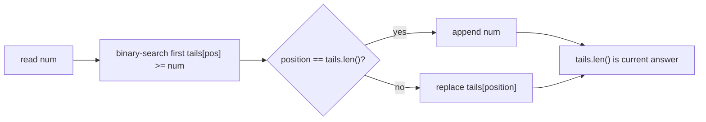

https://leetcode.com/problems/longest-increasing-subsequence/

# 300. Longest Increasing Subsequence

Medium

Given an integer array `nums`, return the length of the longest strictly increasing subsequence.

## Example 1

Input: `nums = [10,9,2,5,3,7,101,18]`

Output: `4`

Explanation: The longest increasing subsequence is `[2,3,7,101]`, therefore the length is `4`.

## Example 2

Input: `nums = [0,1,0,3,2,3]`

Output: `4`

## Example 3

Input: `nums = [7,7,7,7,7,7,7]`

Output: `1`

## Constraints

- `1 <= nums.length <= 2500`
- `-10^4 <= nums[i] <= 10^4`

Follow-up: Can you come up with an algorithm that runs in `O(n log(n))` time complexity?

## My Solution - Dynamic Programming by Ending Position

### Approach

Define:

```text
dp[i] = the length of the longest increasing subsequence ending at nums[i]
```

The phrase “ending at `nums[i]`” is important. It gives every state a concrete final element and makes its possible predecessors clear.

For every earlier index `j`:

- `j < i` ensures that `nums[j]` appears before `nums[i]`;
- `nums[j] < nums[i]` ensures that appending `nums[i]` keeps the subsequence strictly increasing.

When both conditions hold, extend the best subsequence ending at `j`:

```text
dp[i] = max(dp[i], dp[j] + 1)
```

Every element can form a subsequence of length `1`, so all states start at `1`. The answer is not necessarily `dp[n - 1]`, because the longest subsequence may end before the final array element. The implementation maintains `res = max(dp[i])` as each position is completed.

For `nums = [10,9,2,5,3,7,101,18]`, the states are:

```text
nums:  10  9  2  5  3  7  101  18
dp:     1  1  1  2  2  3   4    4
```

The invariant is that after processing index `i`, `dp[i]` is exactly the best length among increasing subsequences whose last element is `nums[i]`. Any such subsequence either contains only `nums[i]`, or has one earlier valid predecessor `nums[j]`; considering every `j < i` finds the best possible predecessor.

### Complexity

- Time: `O(n^2)`
- Space: `O(n)`

```rust
impl Solution {
    pub fn length_of_lis(nums: Vec<i32>) -> i32 {
        let n = nums.len();
        // dp[i] means the longest subseq end with nums[i]
        let mut dp = vec![1; n];

        let mut res = 1;

        for i in 1..n {
            for j in 0..i {
                if nums[j] < nums[i] {
                    dp[i] = dp[i].max(dp[j] + 1);
                }
            }

            res = res.max(dp[i]);
        }

        res
    }
}
```

## Classic Solution - 1 - Patience Sorting with Lower Bound

### Approach

Maintain `tails`, where `tails[len - 1]` is the smallest possible ending value of an increasing subsequence of length `len` found so far.

For each `num`, binary-search the first position whose value is greater than or equal to `num`:

- if such a position exists, replace its value with `num`;
- otherwise, append `num` and increase the best length by one.

Replacing a tail does not necessarily preserve the exact subsequence represented by `tails`. Instead, it makes that length easier to extend: a smaller ending value leaves more possible future numbers that can follow it. The array remains sorted, so binary search is valid.

For the first example, the states are:

```text
10 -> [10]
9  -> [9]
2  -> [2]
5  -> [2, 5]
3  -> [2, 3]
7  -> [2, 3, 7]
101 -> [2, 3, 7, 101]
18  -> [2, 3, 7, 18]
```

The length of `tails` is always the length of the longest increasing subsequence seen so far. Equal values replace an existing tail instead of extending the array, which enforces the strictly increasing requirement.



### Complexity

- Time: `O(n log n)`
- Space: `O(n)`

```rust
impl Solution {
    pub fn length_of_lis(nums: Vec<i32>) -> i32 {
        let mut tails = Vec::new();

        for num in nums {
            let mut left = 0;
            let mut right = tails.len();

            while left < right {
                let mid = left + (right - left) / 2;

                if tails[mid] < num {
                    left = mid + 1;
                } else {
                    right = mid;
                }
            }

            if left == tails.len() {
                tails.push(num);
            } else {
                tails[left] = num;
            }
        }

        tails.len() as i32
    }
}
```
