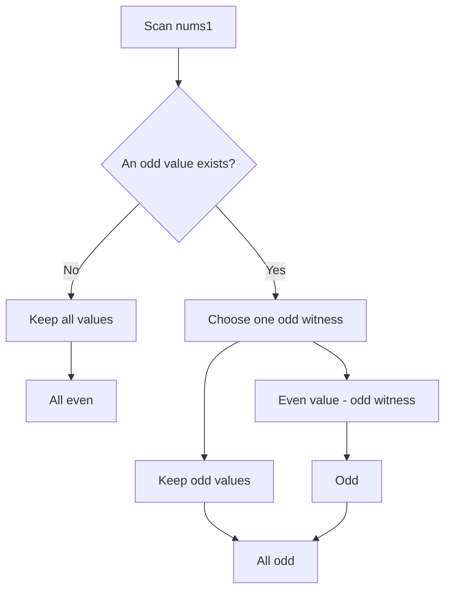

https://leetcode.com/problems/construct-uniform-parity-array-i/

# 3875. Construct Uniform Parity Array I

Easy

You are given an array `nums1` of `n` distinct integers. Construct an array `nums2` of the same length whose elements are either all odd or all even.

For each index `i`, choose exactly one of:

- `nums2[i] = nums1[i]`
- `nums2[i] = nums1[i] - nums1[j]`, where `j != i`

Return `true` if such an array can be constructed.

## Example 1

Input: `nums1 = [2,3]`

Output: `true`

Explanation:

- Choose `nums2[0] = nums1[0] - nums1[1] = 2 - 3 = -1`.
- Choose `nums2[1] = nums1[1] = 3`.
- `nums2 = [-1, 3]`, and both elements are odd.

## Example 2

Input: `nums1 = [4,6]`

Output: `true`

Explanation:

- Choose `nums2[0] = nums1[0] = 4`.
- Choose `nums2[1] = nums1[1] = 6`.
- `nums2 = [4, 6]`, and all elements are even.

## Constraints

- `1 <= n == nums1.length <= 100`
- `1 <= nums1[i] <= 100`
- `nums1` consists of distinct integers.

## My Solution - Always True

### Approach

The submitted implementation returns `true` unconditionally:

- `true` is indeed the correct answer for every valid input.
- If `nums1` contains no odd number, leave every element unchanged; all elements are even.
- Otherwise, choose any odd `nums1[k]` as a reference. Leave every odd element unchanged. For every even element `nums1[i]`, subtract the reference odd number; since `i` is even and `k` is odd, `nums1[i] - nums1[k]` is odd.
- The reference index is never equal to an even element's index, so every required subtraction is legal. Thus all resulting elements can be made odd.

The key invariant is parity arithmetic: even minus odd is odd, while unchanged odd values remain odd. Therefore one of the two uniform parities is always achievable.

The function does not inspect `nums1`, but this is safe because the proof depends only on the fact that every input falls into one of the two cases above.

### Complexity

- Time: `O(1)`
- Space: `O(1)`

```rust
impl Solution {
    pub fn uniform_array(nums1: Vec<i32>) -> bool {
        true
    }
}
```

## Classic Solution - 1 - Parity Witness

### Approach

This implementation makes the proof constructive:

1. If there is no odd element, return `true` because keeping every value produces an all-even array.
2. Otherwise, keep the index of one odd element as a parity witness.
3. Every odd value can be kept unchanged.
4. Every even value can subtract the odd witness, producing an odd value.

The witness is valid for every even index because an even value cannot be the same element as the odd witness. Consequently, all positions can be made odd. This covers every possible input, so the answer is always `true`.

### Complexity

- Time: `O(n)`
- Space: `O(1)`



```rust
impl Solution {
    pub fn uniform_array(nums1: Vec<i32>) -> bool {
        let has_odd = nums1.iter().any(|&value| value % 2 != 0);

        if !has_odd {
            return true;
        }

        // With an odd witness, every even value can become odd by subtraction.
        true
    }
}
```
