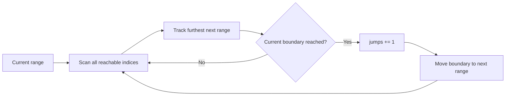

https://leetcode.com/problems/jump-game-ii/

# 45. Jump Game II

Medium

You are given a 0-indexed array of integers `nums` of length `n`. You start at index `0`. `nums[i]` is the maximum length of a forward jump from index `i`; from `i`, you may jump to any index `i + j` where `0 <= j <= nums[i]` and `i + j < n`.

Return the minimum number of jumps needed to reach index `n - 1`. The test cases guarantee that the last index is reachable.

## Example 1

Input: `nums = [2,3,1,1,4]`

Output: `2`

Explanation: Jump 1 step from index 0 to 1, then 3 steps to the last index.

## Example 2

Input: `nums = [2,3,0,1,4]`

Output: `2`

## Constraints

- `1 <= nums.length <= 10^4`
- `0 <= nums[i] <= 1000`
- It's guaranteed that you can reach `nums[n - 1]`.

## My Solution - Forward Dynamic Programming

### Approach

Define `dp[i]` as the minimum number of jumps needed to reach index `i`.

- Initially, `dp[0] = 0`; every other state is set to `i32::MAX`.
- When processing index `i`, one jump can reach every index in the interval `[i + 1, min(i + nums[i], n - 1)]`.
- For each such destination `j`, relax the state with:

  `dp[j] = min(dp[j], dp[i] + 1)`

The invariant is that after processing a reachable index `i`, `dp[i]` is the fewest jumps needed to reach it. Any path reaching a position `j` through `i` consists of an optimal path to `i` followed by one jump, so `dp[i] + 1` is a valid candidate. Taking the minimum over all predecessors yields the optimum.

For `nums = [2,3,1,1,4]`, the states evolve as:

```text
dp[0] = 0
from 0: dp[1] = 1, dp[2] = 1
from 1: dp[2] = 1, dp[3] = 2, dp[4] = 2
answer: dp[4] = 2
```

The nested loop is the direct DP formulation: every index explicitly relaxes a whole reachable interval. The problem guarantee ensures the final state is reachable; the submitted implementation also relies on reachable processed states when adding `1` to `dp[i]`.

### Complexity

- Time: `O(n^2)` in the worst case
- Space: `O(n)`

```rust
use std::i32;
impl Solution {
    pub fn jump(nums: Vec<i32>) -> i32 {
        let n = nums.len();

        let mut dp = vec![i32::MAX; n];

        dp[0] = 0;

        for i in 0..n {
            let end = (i + nums[i] as usize).min(n - 1);

            for j in (i + 1)..=end {
                dp[j] = dp[j].min(dp[i] + 1);
            }
        }

        dp[n - 1]
    }
}
```

## Classic Solution - 1 - Greedy Range Expansion

### Approach

The DP considers every destination inside the interval reachable from `i`. We can merge states that have the same jump count into one range.

Maintain:

- `current_end`: the furthest index reachable using exactly `jumps` jumps.
- `next_end`: the furthest index reachable using `jumps + 1` jumps from any index in the current range.

Scan all indices in the current range. For each index `i`, update:

`next_end = max(next_end, i + nums[i])`

When the scan reaches `current_end`, the current layer is exhausted. One more jump is necessary, so increment `jumps` and move the boundary to `next_end`.

The invariant is that every index in the current scanning range is reachable with the same minimum number of jumps. Therefore, choosing the maximum next boundary preserves every possible optimal continuation; no individual destination needs a separate DP value.

The loop stops before the last index because reaching the last index is counted when its containing range is entered.

### Complexity

- Time: `O(n)`
- Space: `O(1)`



```rust
impl Solution {
    pub fn jump(nums: Vec<i32>) -> i32 {
        let mut jumps = 0;
        let mut current_end = 0;
        let mut next_end = 0;

        for i in 0..nums.len() - 1 {
            next_end = next_end.max(i + nums[i] as usize);

            if i == current_end {
                jumps += 1;
                current_end = next_end;
            }
        }

        jumps
    }
}
```
