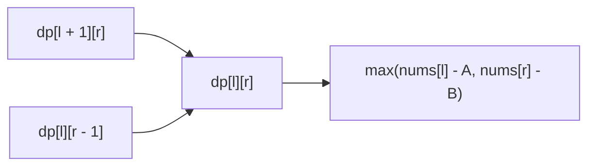

https://leetcode.com/problems/predict-the-winner/

# 486. Predict the Winner

Medium

You are given an integer array `nums`. Two players take turns taking one number from either end of the remaining array and add it to their own score. Player 1 moves first, and both players play optimally. Return `true` if Player 1 can win or tie.

## Example 1

Input: `nums = [1,5,2]`

Output: `false`

Explanation: No matter whether Player 1 takes `1` or `2`, Player 2 can take `5`. Player 1's final score is `3`, while Player 2's score is `5`.

## Example 2

Input: `nums = [1,5,233,7]`

Output: `true`

Explanation: Player 1 can take `1`. Player 2 must then take either `5` or `7`, allowing Player 1 to take `233`. Player 1 finishes with `234`, while Player 2 finishes with `12`.

## Constraints

- `1 <= nums.length <= 20`
- `0 <= nums[i] <= 10^7`

## My Solution - Two-Dimensional Interval DP

### Approach

Define `dp[l][r]` as the maximum score difference that the player whose turn it is can obtain over the other player when only `nums[l..=r]` remains:

```text
dp[l][r] = current player's final score - other player's final score
```

If the current player takes the left value, the opponent becomes the current player in the remaining interval. Therefore the resulting difference is:

```text
nums[l] - dp[l + 1][r]
```

Taking the right value gives:

```text
nums[r] - dp[l][r - 1]
```

The current player chooses the better of these two options:

```text
dp[l][r] = max(
    nums[l] - dp[l + 1][r],
    nums[r] - dp[l][r - 1]
)
```

For a one-element interval, the current player takes that value, so `dp[i][i] = nums[i]`. Since `dp[0][n - 1]` is evaluated from Player 1's perspective, Player 1 can win or tie exactly when it is non-negative.
The table must be filled in increasing interval length. The initialization fills every length-one interval `dp[i][i]`. When processing an interval of length `len`, the transition reads only the two intervals of length `len - 1`:

```text
dp[l + 1][r]  ->  [l + 1, r]
dp[l][r - 1]  ->  [l, r - 1]
```

Both dependencies have already been computed in the previous outer-loop iteration. Therefore, when the code reaches `dp[l][r]`, its required states are guaranteed to be valid. The loop then fills the table diagonal by diagonal:

```text
length 1: dp[0][0], dp[1][1], ..., dp[n - 1][n - 1]
length 2: dp[0][1], dp[1][2], ..., dp[n - 2][n - 1]
length 3: dp[0][2], dp[1][3], ...
...
length n: dp[0][n - 1]
```

This is why initializing only the diagonal and iterating `len` from `2` to `n` is sufficient; no state is read before its own dependencies have been established.

### Complexity

- Time: `O(n²)`
- Space: `O(n²)`

```rust
use std::cmp::max;
impl Solution {
    pub fn predict_the_winner(nums: Vec<i32>) -> bool {
        let n = nums.len();

        let mut dp = vec![vec![0; n]; n];

        for i in 0..n {
            dp[i][i] = nums[i];
        }

        for len in 2..=n {
            for l in 0..=n - len {
                let r = l + len - 1;

                let take_l = nums[l] - dp[l + 1][r];
                let take_r = nums[r] - dp[l][r - 1];

                dp[l][r] = max(take_l, take_r);
            }
        }

        dp[0][n - 1] >= 0
    }
}
```

## Classic Solution - 1 - One-Dimensional Interval DP

### Approach

The two-dimensional table is only used through two neighboring states:

- `dp[l + 1][r]`, the interval below the current state;
- `dp[l][r - 1]`, the state immediately to its left.

Store only the right endpoint in a one-dimensional array. Before updating `dp[r]`, it represents `dp[l + 1][r]`. After `dp[r - 1]` has been updated in the current outer-loop iteration, it represents `dp[l][r - 1]`.

Process `l` from right to left and `r` from left to right. This ordering preserves both dependencies:



The invariant is that, at the moment `dp[r]` is updated:

```text
dp[r]   = old dp[l + 1][r]
dp[r-1] = new dp[l][r - 1]
```

Thus the one-dimensional update is equivalent to the two-dimensional recurrence while using linear auxiliary space.

### Complexity

- Time: `O(n²)`
- Space: `O(n)`

```rust
use std::cmp::max;

impl Solution {
    pub fn predict_the_winner(nums: Vec<i32>) -> bool {
        let n = nums.len();
        let mut dp = nums.clone();

        for l in (0..n - 1).rev() {
            for r in l + 1..n {
                let take_left = nums[l] - dp[r];
                let take_right = nums[r] - dp[r - 1];

                dp[r] = max(take_left, take_right);
            }
        }

        dp[n - 1] >= 0
    }
}
```
