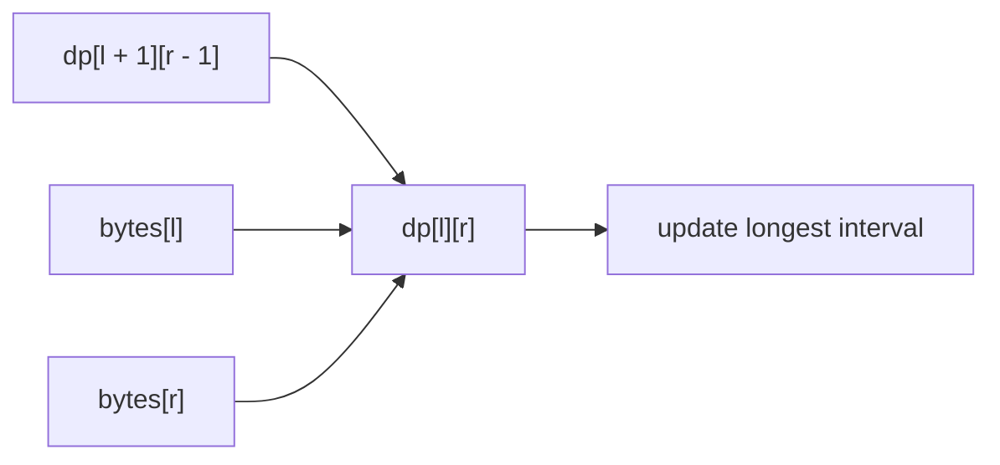

https://leetcode.com/problems/longest-palindromic-substring/

# 5. Longest Palindromic Substring

Medium

Given a string `s`, return the longest palindromic substring in `s`. A palindrome reads the same forward and backward. If multiple answers have the same length, any one of them is valid.

## Example 1

Input: `s = "babad"`

Output: `"bab"`

Explanation: `"aba"` is also a valid answer.

## Example 2

Input: `s = "cbbd"`

Output: `"bb"`

## Constraints

- `1 <= s.length <= 1000`
- `s` consists of only digits and English letters.

## My Solution - Two-Dimensional Interval DP

### Approach

Define the Boolean interval state:

```text
dp[l][r] = whether s[l..=r] is a palindrome
```

An interval is a palindrome when its two boundary bytes match and its inner interval is also a palindrome:

```text
dp[l][r] = bytes[l] == bytes[r]
           && (len <= 2 || dp[l + 1][r - 1])
```

The intervals of length one and two are the base cases. For longer intervals, `dp[l][r]` depends on the interval `[l + 1, r - 1]`, which is two characters shorter. Therefore, the table is filled by increasing interval length. When a state is true, `base` records its starting position and `gap` records its length if it is longer than the best answer found so far.

The dependency is:



The input contains only digits and English letters, so byte indexing and byte slicing are valid for this implementation.

### Correctness

For every interval `[l, r]`, the algorithm marks it as a palindrome exactly when its boundary characters match and its inner interval is a palindrome. The base cases establish this property for all intervals of length one and two. By induction on interval length, every `dp[l][r]` is correct. Tracking the longest true interval therefore returns a longest palindromic substring.

### Complexity

- Time: `O(n²)`
- Space: `O(n²)`

```rust
impl Solution {
    pub fn longest_palindrome(s: String) -> String {
        let n = s.len();
        // dp[i][j]: slice within i - j is palindrome
        let mut dp = vec![vec![false; n]; n];
        let mut base = 0;
        let mut gap = 0;

        let bytes = s.as_bytes();
        for len in 1..=n {
            for l in 0..=n - len {
                let r = l + len - 1;

                dp[l][r] = bytes[l] == bytes[r] && (len <= 2 || dp[l + 1][r - 1]);

                if dp[l][r] && len > gap {
                    gap = len;
                    base = l;
                }
            }
        }

        s[base..base + gap].to_string()
    }
}
```

## Classic Solution - 1 - Expand Around Every Center

### Approach

Every palindrome has a center. Its center is either:

- one character, producing an odd-length palindrome;
- the gap between two adjacent characters, producing an even-length palindrome.

For each index `center`, expand two pointers outward while the bytes match. Evaluate both centers `(center, center)` and `(center, center + 1)`, then retain the longest interval. The pointers stop immediately after the first mismatch or at a string boundary, so each center directly yields its longest palindrome.

The returned interval is represented by its starting index and length, so no additional substring table is needed.

### Correctness

Every palindromic substring has exactly one character center or one adjacent-character gap center. The algorithm checks both center types at every position and expands until no larger palindrome can be formed around that center. Thus it considers the longest palindrome for every possible center and returns the longest one overall.

### Complexity

- Time: `O(n²)`
- Space: `O(1)`

```rust
impl Solution {
    pub fn longest_palindrome(s: String) -> String {
        let bytes = s.as_bytes();
        let n = bytes.len();
        let mut best_start = 0;
        let mut best_len = 1;

        fn expand(bytes: &[u8], left: usize, right: usize) -> (usize, usize) {
            let mut left = left as isize;
            let mut right = right as isize;

            while left >= 0
                && right < bytes.len() as isize
                && bytes[left as usize] == bytes[right as usize]
            {
                left -= 1;
                right += 1;
            }

            ((left + 1) as usize, (right - left - 1) as usize)
        }

        for center in 0..n {
            let (odd_start, odd_len) = expand(bytes, center, center);
            if odd_len > best_len {
                best_start = odd_start;
                best_len = odd_len;
            }

            if center + 1 < n {
                let (even_start, even_len) = expand(bytes, center, center + 1);
                if even_len > best_len {
                    best_start = even_start;
                    best_len = even_len;
                }
            }
        }

        s[best_start..best_start + best_len].to_string()
    }
}
```
