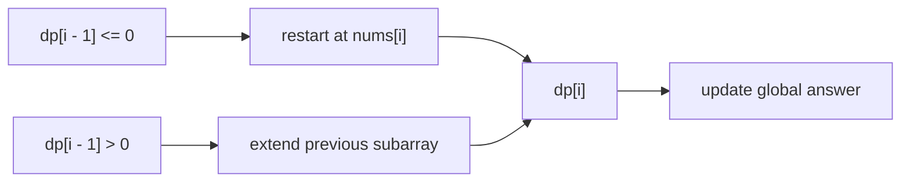

https://leetcode.com/problems/maximum-subarray/

# 53. Maximum Subarray

Medium

Given an integer array `nums`, find the subarray with the largest sum, and return its sum.

## Example 1

Input: `nums = [-2,1,-3,4,-1,2,1,-5,4]`

Output: `6`

Explanation: The subarray `[4,-1,2,1]` has the largest sum 6.

## Example 2

Input: `nums = [1]`

Output: `1`

Explanation: The subarray `[1]` has the largest sum 1.

## Example 3

Input: `nums = [5,4,-1,7,8]`

Output: `23`

Explanation: The subarray `[5,4,-1,7,8]` has the largest sum 23.

## Constraints

- `1 <= nums.length <= 10^5`
- `-10^4 <= nums[i] <= 10^4`

Follow-up: If you have figured out the `O(n)` solution, try coding another solution using the divide and conquer approach, which is more subtle.

## My Solution - Prefix-Ending Dynamic Programming

### Approach

Define `dp[i]` as the maximum sum of a non-empty subarray that must end at `nums[i]`.

For a subarray ending at `nums[i]`, there are only two possibilities:

1. Start a new subarray at `nums[i]`, with sum `nums[i]`.
2. Extend the best subarray ending at `nums[i - 1]`, with sum `dp[i - 1] + nums[i]`.

Therefore:

```text
dp[i] = max(nums[i], dp[i - 1] + nums[i])
```

The submitted code uses an equivalent form. It initializes `dp[i]` with `nums[i]`, then adds `dp[i - 1]` only when that previous sum is positive:

```text
if dp[i - 1] > 0:
    dp[i] += dp[i - 1]
```

This works because a non-positive prefix can never improve a sum that ends at the current element. Dropping it is equivalent to starting over at `nums[i]`.

The state `dp[i]` only describes subarrays ending at one particular position, so it is not necessarily the final answer. The global maximum is the best state over all endpoints, which the code stores in `res`.

For the official example `[-2,1,-3,4,-1,2,1,-5,4]`, the ending states are:

```text
nums: -2   1  -3   4   -1    2    1   -5    4
dp:   -2   1  -2   4    3    5    6    1    5
```

The largest state is `6`, corresponding to the subarray `[4,-1,2,1]`.



### Correctness Invariant

After processing index `i`, `dp[i]` is exactly the maximum sum among all non-empty subarrays whose right endpoint is `i`. Every such subarray either contains `nums[i - 1]`, in which case it is formed by extending the optimal state `dp[i - 1]`, or starts at `i`, in which case its sum is `nums[i]`. Taking the larger candidate preserves the invariant. Taking the maximum over all `dp[i]` values yields the maximum-sum subarray without a restriction on its endpoint.

### Complexity

- Time: `O(n)`
- Space: `O(n)`

```rust
impl Solution {
    pub fn max_sub_array(nums: Vec<i32>) -> i32 {
        let n = nums.len();
        // dp[i]: end as nums[i]'s largest subarrary sum
        let mut dp = vec![0; n];

        for i in 0..n {
            dp[i] = nums[i];
        }

        let mut res = dp[0];

        for i in 1..n {
            if dp[i - 1] > 0 {
                dp[i] += dp[i - 1];
            }

            res = res.max(dp[i]);
        }

        res
    }
}
```

## Classic Solution - 1 - Space-Optimized Kadane DP

### Approach

The recurrence is the same, but `dp[i]` only depends on `dp[i - 1]`. There is no need to retain the entire DP table. Keep:

- `current`: the maximum sum of a non-empty subarray ending at the current element;
- `answer`: the maximum `current` value seen so far.

The update:

```text
current = max(nums[i], current + nums[i])
answer = max(answer, current)
```

can be written compactly as:

```text
current = max(0, current) + nums[i]
```

If `current` is negative, discard the previous subarray and restart at the current number. If it is positive, extending it is at least as good as restarting. This is the same ending-position invariant as the two-dimensional presentation, compressed to one scalar.

### Complexity

- Time: `O(n)`
- Space: `O(1)`

```rust
impl Solution {
    pub fn max_sub_array(nums: Vec<i32>) -> i32 {
        let mut current = nums[0];
        let mut answer = nums[0];

        for &num in nums.iter().skip(1) {
            current = current.max(0) + num;
            answer = answer.max(current);
        }

        answer
    }
}
```
