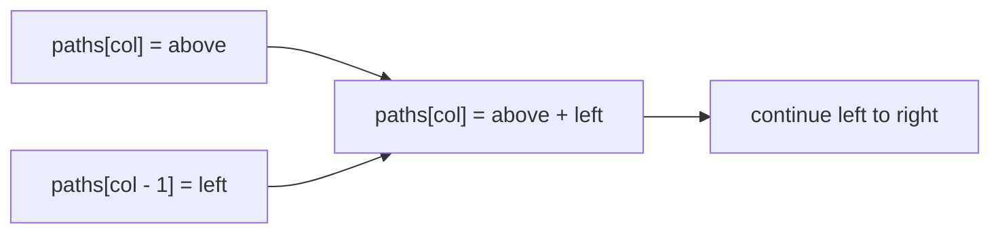

https://leetcode.com/problems/unique-paths/

# 62. Unique Paths

Medium

There is a robot on an `m x n` grid. The robot starts at the top-left corner and wants to reach the bottom-right corner. It can move only down or right. Return the number of unique paths from start to finish.

The test cases are generated so that the answer is less than or equal to `2 * 10^9`.

## Example 1

Input: `m = 3, n = 7`

Output: `28`


## Example 2

Input: `m = 3, n = 2`

Output: `3`

Explanation: The three paths are:

1. `Right -> Down -> Down`
2. `Down -> Down -> Right`
3. `Down -> Right -> Down`

## Constraints

- `1 <= m, n <= 100`

## My Solution - Two-Dimensional Dynamic Programming

### Approach

Let `dp[row][col]` be the number of unique paths from the top-left corner to cell `(row, col)`.

Every non-boundary cell can be reached only from:

- the cell directly above it;
- the cell directly to its left.

Therefore, the transition is:

```text
dp[row][col] = dp[row - 1][col] + dp[row][col - 1]
```

Every cell in the first row has exactly one path consisting only of right moves, and every cell in the first column has exactly one path consisting only of down moves. The implementation initializes those boundaries to `1`, then fills the remaining cells from top to bottom and left to right.

The invariant is that after computing `dp[row][col]`, it contains exactly the number of valid paths ending at that cell. The two predecessor sets are disjoint because the final move is either down or right, so adding them counts every path exactly once.

The function parameters remain `i32`, but the values are converted to `usize` once because vector dimensions and indices require `usize`. Under the constraints, both dimensions are positive, so the final indexing is valid.

### Complexity

- Time: `O(m * n)`
- Space: `O(m * n)`

```rust
impl Solution {
    pub fn unique_paths(m: i32, n: i32) -> i32 {
        let m = m as usize;
        let n = n as usize;
        let mut dp = vec![vec![0; n]; m];

        for col in 0..n {
            dp[0][col] = 1;
        }

        for row in 0..m {
            dp[row][0] = 1;
        }

        for row in 1..m {
            for col in 1..n {
                dp[row][col] = dp[row - 1][col] + dp[row][col - 1];
            }
        }

        dp[m - 1][n - 1]
    }
}
```

## Classic Solution - 1 - One-Dimensional Dynamic Programming

### Approach

The value for a cell depends only on the cell above it and the cell to its left. While scanning one row from left to right, the one-dimensional array can represent the current row:

- before updating `paths[col]`, it still stores the value from the row above;
- after updating it, it stores the current row's value.

The first row is initialized to all `1`s. For every later row:

```text
paths[col] = paths[col] + paths[col - 1]
             above        left
```

For the `3 x 2` example, the state evolves as:

```text
[1, 1]  first row
[1, 2]  second row
[1, 3]  third row
```

At each update, `paths[col - 1]` is already the current-row value, while `paths[col]` is still the previous-row value. This preserves exactly the two predecessors required by the two-dimensional recurrence without storing all rows.



### Complexity

- Time: `O(m * n)`
- Space: `O(n)`

```rust
impl Solution {
    pub fn unique_paths(m: i32, n: i32) -> i32 {
        let m = m as usize;
        let n = n as usize;
        let mut paths = vec![1; n];

        for _ in 1..m {
            for col in 1..n {
                paths[col] += paths[col - 1];
            }
        }

        paths[n - 1]
    }
}
```
