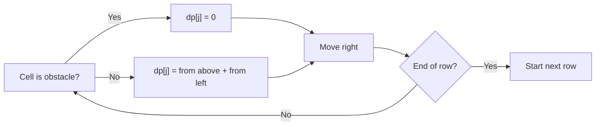

https://leetcode.com/problems/unique-paths-ii/

# 63. Unique Paths II

Medium

You are given an `m x n` integer array `grid`. A robot starts at the top-left corner, `grid[0][0]`, and wants to reach the bottom-right corner, `grid[m - 1][n - 1]`. It can move only right or down.

An obstacle and an empty space are marked as `1` and `0`, respectively. A path cannot include an obstacle. Return the number of unique paths to the bottom-right corner.

The answer is guaranteed to be less than or equal to `2 * 10^9`.

## Example 1


Input: `obstacleGrid = [[0,0,0],[0,1,0],[0,0,0]]`

Output: `2`

Explanation: There is one obstacle in the middle of the 3x3 grid. The two paths are:

1. Right -> Right -> Down -> Down
2. Down -> Down -> Right -> Right

## Example 2


Input: `obstacleGrid = [[0,1],[0,0]]`

Output: `1`

## Constraints

- `m == obstacleGrid.length`
- `n == obstacleGrid[i].length`
- `1 <= m, n <= 100`
- `obstacleGrid[i][j]` is `0` or `1`.

## My Solution - Two-Dimensional Dynamic Programming

### Approach

Define `dp[i][j]` as the number of valid paths from the start to cell `(i, j)`.

- If the start cell is an obstacle, no path exists, so return `0`.
- Set `dp[0][0] = 1`.
- For the first row, a cell can only be reached from the left. Once an obstacle appears, all cells to its right remain unreachable.
- For the first column, a cell can only be reached from above. The same blocking rule applies.
- For an ordinary cell, the final step must come either from above or from the left:

  `dp[i][j] = dp[i - 1][j] + dp[i][j - 1]`

- For an obstacle, set `dp[i][j] = 0`, because no valid path may pass through it.

The invariant is that before processing `(i, j)`, the previously computed top and left states already count every valid path entering this cell from those directions. Summing them therefore counts every valid path exactly once, while obstacles contribute no paths.

The submitted implementation clones `obstacle_grid` and reuses the clone as the DP table. Its values are overwritten with path counts, while the original grid remains available for checking whether each cell is an obstacle.

### Complexity

- Time: `O(mn)`
- Space: `O(mn)`

```rust
impl Solution {
    pub fn unique_paths_with_obstacles(obstacle_grid: Vec<Vec<i32>>) -> i32 {
        let m = obstacle_grid.len();
        let n = obstacle_grid[0].len();
        let mut dp = obstacle_grid.clone();
        if obstacle_grid[0][0] == 1 {
            return 0;
        }

        dp[0][0] = 1;

        for i in 1..n {
            if obstacle_grid[0][i] == 1 {
                dp[0][i] = 0;
            } else {
                dp[0][i] = dp[0][i - 1];
            }
        }

        for i in 1..m {
            if obstacle_grid[i][0] == 1 {
                dp[i][0] = 0;
            } else {
                dp[i][0] = dp[i - 1][0];
            }
        }

        for i in 1..m {
            for j in 1..n {
                if obstacle_grid[i][j] == 0 {
                    dp[i][j] = dp[i - 1][j] + dp[i][j - 1];
                } else {
                    dp[i][j] = 0;
                }
            }
        }

        dp[m - 1][n - 1]
    }
}
```

## Classic Solution - 1 - One-Dimensional Dynamic Programming

### Approach

The state for cell `(i, j)` depends only on the cell directly above and the cell directly to the left. While scanning each row from left to right, a one-dimensional array is sufficient:

- `dp[j]` stores the number of paths reaching column `j` in the current row.
- Before processing `(i, j)`, `dp[j]` still represents the path count from above.
- `dp[j - 1]` already represents the path count from the left.
- For an open cell, update `dp[j] += dp[j - 1]`.
- For an obstacle, set `dp[j] = 0`.

The invariant is that after processing column `j`, `dp[j]` equals the number of valid paths to the current cell. Resetting an obstacle to zero also prevents later cells in that row from incorrectly using paths through it.

This is the same recurrence as the two-dimensional solution, but old rows are discarded because they are no longer needed.

### Complexity

- Time: `O(mn)`
- Space: `O(n)`



```rust
impl Solution {
    pub fn unique_paths_with_obstacles(obstacle_grid: Vec<Vec<i32>>) -> i32 {
        let n = obstacle_grid[0].len();
        let mut dp = vec![0; n];
        dp[0] = 1;

        for row in obstacle_grid {
            for j in 0..n {
                if row[j] == 1 {
                    dp[j] = 0;
                } else if j > 0 {
                    dp[j] += dp[j - 1];
                }
            }
        }

        dp[n - 1]
    }
}
```
