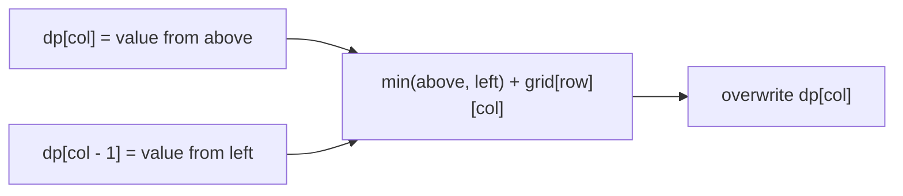

https://leetcode.com/problems/minimum-path-sum/

# 64. Minimum Path Sum

Medium

Given an `m x n` grid filled with non-negative numbers, find a path from the top-left corner to the bottom-right corner that minimizes the sum of all numbers along its path. The robot can move only down or right.

## Example 1

Input: `grid = [[1,3,1],[1,5,1],[4,2,1]]`

Output: `7`

Explanation: The path `1 → 3 → 1 → 1 → 1` minimizes the sum.


## Example 2

Input: `grid = [[1,2,3],[4,5,6]]`

Output: `12`

## Constraints

- `m == grid.length`
- `n == grid[i].length`
- `1 <= m, n <= 200`
- `0 <= grid[i][j] <= 200`

## My Solution - Two-Dimensional Dynamic Programming

### Approach

Let `dp[row][col]` be the minimum path sum needed to reach the cell `(row, col)` from the top-left corner.

The top-left cell has no predecessor, so its value is simply `grid[0][0]`. A cell in the first row can only be reached from the left, while a cell in the first column can only be reached from above. Every other cell can be reached from either direction, so the smaller predecessor gives the optimal path:

```text
dp[row][col] =
    min(dp[row - 1][col], dp[row][col - 1]) + grid[row][col]
```

The nested loop handles all three cases in one pass:

- initialize the starting cell;
- accumulate the only available predecessor on a boundary;
- choose the smaller of the two predecessors for an interior cell.

The invariant is that when `dp[row][col]` is assigned, it already represents the minimum sum to every predecessor of `(row, col)`. Any path reaching the current cell must come through exactly one of those predecessors, so taking their minimum and adding the current grid value is optimal.

The submission checks only whether `grid` has zero rows. The official constraints guarantee both dimensions are at least `1`, so indexing `grid[0]` and returning `dp[m - 1][n - 1]` are valid under the problem contract. For a general-purpose function, an additional `grid[0].is_empty()` check would handle a zero-column grid.

### Complexity

- Time: `O(m * n)`
- Space: `O(m * n)`

```rust
impl Solution {
    pub fn min_path_sum(grid: Vec<Vec<i32>>) -> i32 {
        // dp[i][j] means the minimun path sum till point(i, j)

        let m = grid.len();
        if m < 1 {
            return 0;
        }

        let n = grid[0].len();

        let mut dp = vec![vec![0; n]; m];

        for row in 0..m {
            for col in 0..n {
                if row == 0 && col == 0 {
                    dp[row][col] = grid[row][col];
                    continue;
                }

                if row == 0 {
                    dp[row][col] = dp[row][col - 1] + grid[row][col];
                    continue;
                }
                if col == 0 {
                    dp[row][col] = dp[row - 1][col] + grid[row][col];
                    continue;
                }

                dp[row][col] = dp[row - 1][col].min(dp[row][col - 1]) + grid[row][col];
            }
        }

        dp[m - 1][n - 1]
    }
}
```

## Classic Solution - 1 - One-Dimensional Dynamic Programming

### Approach

The two-dimensional recurrence only needs the value from above and the value from the left. Store one row in `dp`, where `dp[col]` is initially the value from the previous row.

Initialize the first row by accumulating from left to right. For each later row:

- `dp[col]` still contains the minimum path sum from above;
- `dp[col - 1]` has already been updated to the current row and is therefore the left predecessor.

The update is:

```text
dp[col] = min(dp[col], dp[col - 1]) + grid[row][col]
```

For the first example, the row states are:

```text
[1, 4, 5]
[2, 7, 6]
[6, 8, 7]
```

After processing a row, every prefix of `dp` is the minimum path sum for that row. Thus the final entry is the minimum sum to the bottom-right corner.



### Complexity

- Time: `O(m * n)`
- Space: `O(n)`

```rust
impl Solution {
    pub fn min_path_sum(grid: Vec<Vec<i32>>) -> i32 {
        if grid.is_empty() || grid[0].is_empty() {
            return 0;
        }

        let rows = grid.len();
        let cols = grid[0].len();
        let mut dp = vec![0; cols];

        dp[0] = grid[0][0];
        for col in 1..cols {
            dp[col] = dp[col - 1] + grid[0][col];
        }

        for row in 1..rows {
            dp[0] += grid[row][0];

            for col in 1..cols {
                dp[col] = dp[col].min(dp[col - 1]) + grid[row][col];
            }
        }

        dp[cols - 1]
    }
}
```
