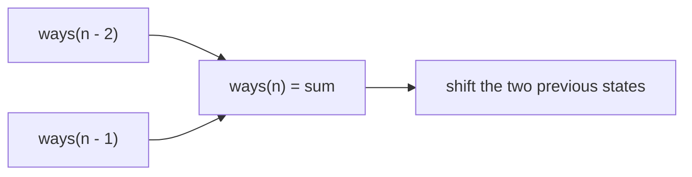

https://leetcode.com/problems/climbing-stairs/

# 70. Climbing Stairs

Easy

You are climbing a staircase. It takes `n` steps to reach the top. Each time you can either climb `1` or `2` steps. Return the number of distinct ways to reach the top.

## Example 1

Input: `n = 2`

Output: `2`

Explanation: There are two ways to climb to the top:

1. `1 step + 1 step`
2. `2 steps`

## Example 2

Input: `n = 3`

Output: `3`

Explanation: There are three ways to climb to the top:

1. `1 step + 1 step + 1 step`
2. `1 step + 2 steps`
3. `2 steps + 1 step`

## Constraints

- `1 <= n <= 45`

## My Solution - Array Dynamic Programming

### Approach

Define `dp[i]` as the number of ways to reach the top after climbing `i + 1` steps. The first two states are:

```text
dp[0] = 1
dp[1] = 2
```

To reach a later step, the last move is either:

- a one-step move from the previous step;
- a two-step move from the step before that.

Therefore:

```text
dp[i] = dp[i - 1] + dp[i - 2]
```

The implementation uses `n as usize` to allocate and index the vector because the LeetCode function parameter is `i32`, while Rust collection lengths and indices use `usize`. Under the problem constraint `n >= 1`, the early return handles `n == 1`, and the initialized states cover the remaining cases.

The state invariant is that after computing `dp[i]`, it contains exactly the number of distinct paths whose final position is the top of the `i + 1`-step staircase. Every valid path has one unique final move, so the one-step and two-step cases partition all paths without overlap.

### Complexity

- Time: `O(n)`
- Space: `O(n)`

```rust
impl Solution {
    pub fn climb_stairs(n: i32) -> i32 {
        let mut dp = vec![0; n as usize];

        if n <= 1 {
            return n;
        }

        dp[0] = 1;
        dp[1] = 2;

        for i in 2..n as usize {
            dp[i] = dp[(i - 1) as usize] + dp[(i - 2) as usize];
        }

        dp[(n - 1) as usize]
    }
}
```

## Classic Solution - 1 - Space-Optimized Fibonacci DP

### Approach

The recurrence only reads the previous two states, so the full `dp` array is unnecessary. Let:

- `prev_two` be the number of ways to reach the step two positions before the current one;
- `prev_one` be the number of ways to reach the immediately previous step.

Initialize the standard base cases:

```text
ways(0) = 1
ways(1) = 1
```

For each `n >= 2`:

```text
ways(n) = ways(n - 1) + ways(n - 2)
```

After computing the next state, shift the two variables forward. The loop uses the original `i32` value directly as a range bound, so no conversion to `usize` is needed because there is no array allocation or indexing.

For `n = 3`, the state evolution is:

```text
ways(0) = 1
ways(1) = 1
ways(2) = 2
ways(3) = 3
```



### Complexity

- Time: `O(n)`
- Space: `O(1)`

```rust
impl Solution {
    pub fn climb_stairs(n: i32) -> i32 {
        let mut prev_two = 1;
        let mut prev_one = 1;

        for _ in 2..=n {
            let current = prev_one + prev_two;
            prev_two = prev_one;
            prev_one = current;
        }

        prev_one
    }
}
```
