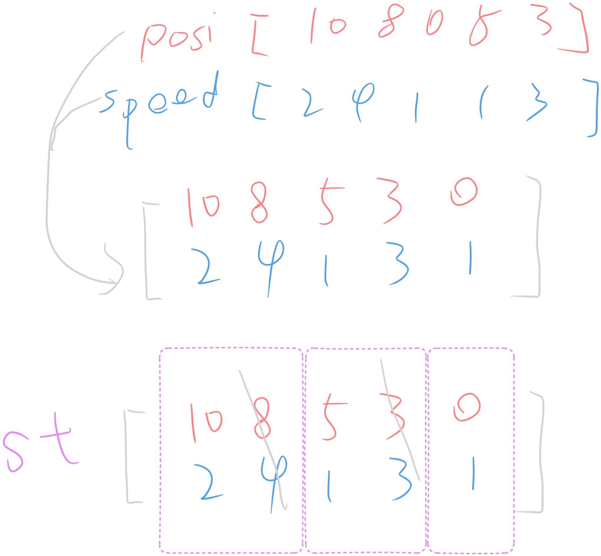

                                       https://leetcode.com/problems/car-fleet/
                                                            
                                                     853. Car Fleet
                                       Medium  │ 4364  1223  │ 55.2% of 899.1K


There are n cars at given miles away from the starting mile 0, traveling to reach the mile target.

You are given two integer arrays position and speed, both of length n, where position[i] is the starting mile of the i^th car and speed[i] is the speed of the i^th car in miles per hour.

A car cannot pass another car, but it can catch up and then travel next to it at the speed of the slower car.

A car fleet is a single car or a group of cars driving next to each other. The speed of the car fleet is the minimum speed of any car in the fleet.

If a car catches up to a car fleet at the mile target, it will still be considered as part of the car fleet.

Return the number of car fleets that will arrive at the destination.


󰛨 Example 1:

Input: target = 12, position = [10,8,0,5,3], speed = [2,4,1,1,3]

Output: 3

Explanation:

	* The cars starting at 10 (speed 2) and 8 (speed 4) become a fleet, meeting each other at 12. The fleet forms at target.
	
	* The car starting at 0 (speed 1) does not catch up to any other car, so it is a fleet by itself.
	
	* The cars starting at 5 (speed 1) and 3 (speed 3) become a fleet, meeting each other at 6. The fleet moves at speed 1 until it reaches target.

󰛨 Example 2:

Input: target = 10, position = [3], speed = [3]

Output: 1

Explanation:
There is only one car, hence there is only one fleet.

󰛨 Example 3:

Input: target = 100, position = [0,2,4], speed = [4,2,1]

Output: 1

Explanation:

	* The cars starting at 0 (speed 4) and 2 (speed 2) become a fleet, meeting each other at 4. The car starting at 4 (speed 1) travels to 5.
	
	* Then, the fleet at 4 (speed 2) and the car at position 5 (speed 1) become one fleet, meeting each other at 6. The fleet moves at speed 1 until it reaches target.


 Constraints:

	* n == position.length == speed.length
	
	* 1 <= n <= 10^5
	
	* 0 < target <= 10^6
	
	* 0 <= position[i] < target
	
	* All the values of position are unique.
	
	* 0 < speed[i] <= 10^6


## Classic Solution - Monotonic stack

> Tips:
>> It seems there is order here(all position lead the way to target)
>> A fleet is a stack.



```rust
use std::collections::HashMap;
impl Solution {
    pub fn car_fleet(target: i32, position: Vec<i32>, speed: Vec<i32>) -> i32 {
        let n = position.len();

        let mut arr: Vec<(i32, i32)> = position
            .iter()
            .enumerate()
            .map(|(i, &p)| (p, speed[i]))
            .collect();

        // order it
        arr.sort_unstable_by(|a, b| b.0.cmp(&a.0));

        let mut st: Vec<(i32, i32)> = Vec::new();

        for (posi, speed) in arr {
            // only care about whether the car is following the pre-fleet head.
            // if pre-fleet head is uncatchable, the pre-pre-fleet-head is also.(Monotonic)
            if let Some(&(pre_posi, pre_speed)) = st.last() {
                let cur_cost = (target - posi) as f64 / speed as f64;
                let pre_cost = (target - pre_posi) as f64 / pre_speed as f64;

                if cur_cost <= pre_cost {
                    continue;
                } else {
                    st.push((posi, speed));
                }
            } else {
                st.push((posi, speed));
            }
        }

        st.len() as i32
    }
}

```
